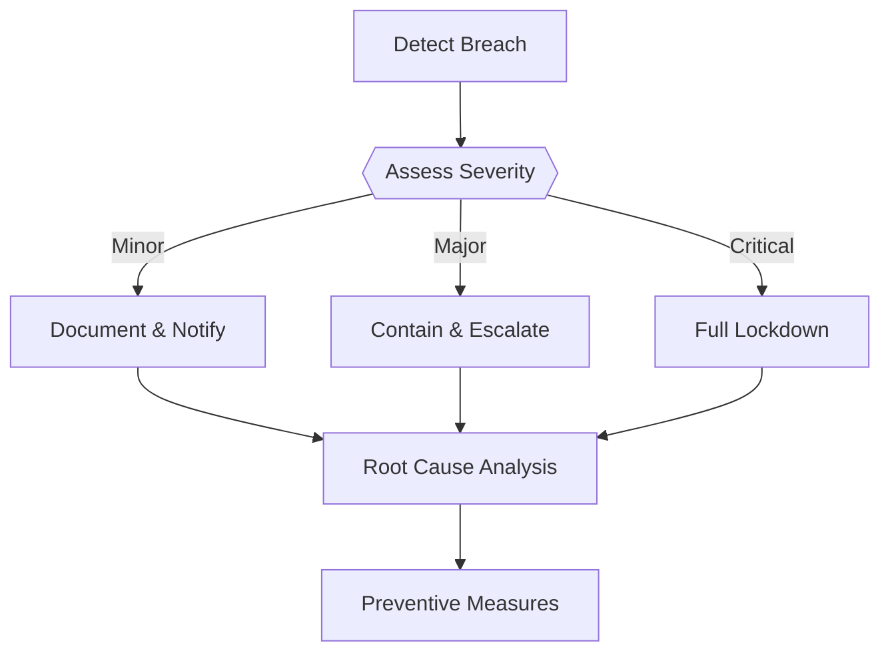
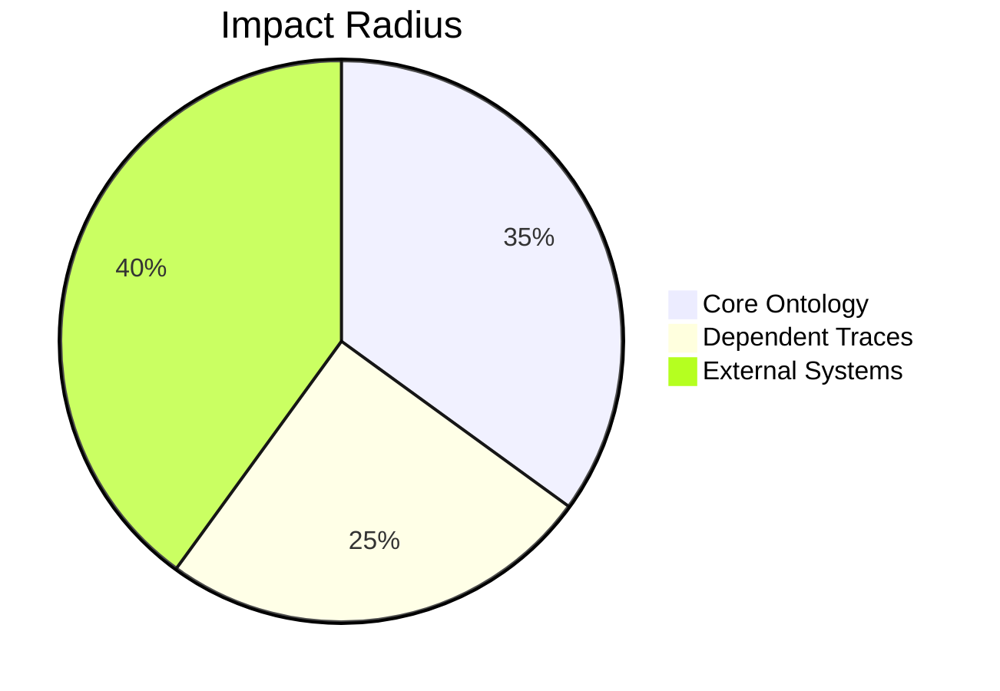
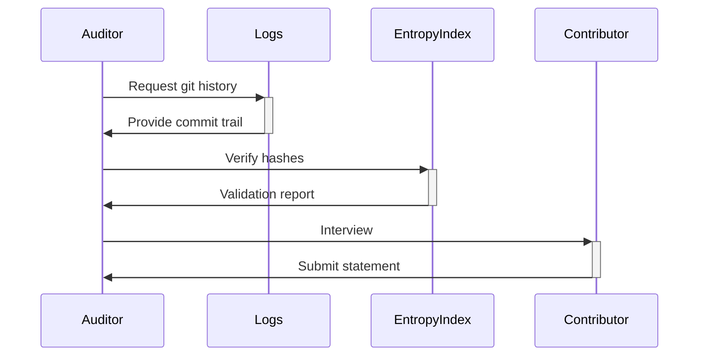

# BREACH REPORTING PROTOCOL



---

## 🚨 Immediate Response Workflow

### 1. Detection & Classification
```bash
# Classify using built-in validator
../../scripts/validate_ethics.sh --severity <DOMAIN>

# Example output
🟡 MINOR BREACH DETECTED: Quarantine bypass in artifact 'tau_manifesto'
```

### 2. Containment Procedures
| Severity | Command | 
|----------|---------|
| **Minor** | `../../scripts/log_breach.sh --minor --domain=artifact` |
| **Major** | `../../scripts/lockdown.sh --domain=system --level=partial` |
| **Critical** | `../../scripts/lockdown.sh --full --reason="critical_breach"` |

### 3. Documentation
Create breach report in `breach_logs/`:
```bash
# Generate filename template
YYYY-MM-DD_<domain>_<severity>.md
# Example: 
touch breach_logs/2023-10-15_artifact_critical.md
```

**Report Template:**
```markdown
# Breach Report: <YYYY-MM-DD>

## Metadata
- **Domain**: [artifact/system]  
- **Severity**: [minor/major/critical]  
- **Detected By**: @username  
- **Validation Hash**: `sha256sum`  

## Impact Analysis


## Remediation Steps
1. [ ] Root cause identified  
2. [ ] Epistemic rollback completed  
3. [ ] Prevention measures implemented  
```

---

## 🔍 Post-Breach Analysis

### Root Cause Investigation


### Mandatory Fields for Analysis
1. **Ontological Contamination Check**
   ```bash
   ../../scripts/validate_ontology.sh --cross-domain
   ```
2. **Tension Metric Audit**
   ```bash
   ../../scripts/audit_tension.sh --breach-id=<ID>
   ```
3. **Paradox Log Correlation**
   ```bash
   grep -rin "collapse" dialectical_cores/ | grep <BREACH_DATE>
   ```

---

## 🛡️ Prevention Framework

### Recurrent Breach Patterns
| Pattern | Detection Command | Fix |
|---------|-------------------|-----|
| Gen1 Tampering | `../../scripts/validate_immutability.sh` | Full trace rebuild |
| Quarantine Bypass | `diff literary_ideas/ quarantine/` | Manual rescan |
| Tension Forgery | `../../scripts/audit_tension.sh --verify` | δ recalibration |

### Training Simulations
```bash
# Run breach simulation
../../scripts/simulate_breach.sh --type=minor
../../scripts/simulate_breach.sh --type=critical

# Expected outcome
🟢 SIMULATION PASSED: Contained breach in 2m 18s
```

---

## 📋 Breach Severity Examples

### Minor Breach Scenario
**Description**: Contributor accidentally skips quarantine scan  
**Fix**:
```bash
# Move file retroactively
mv entropy_index/artifact/gen1_* quarantine/holding_patterns/
../../scripts/scan_unencoded_artifacts.sh --force
```

### Critical Breach Scenario
**Description**: Malicious SHA-256 hash modification in Gen1 trace  
**Response**:
```bash
# 1. Immediate lockdown
../../scripts/lockdown.sh --full --reason="hash_tampering"

# 2. Validate all traces
../../scripts/validate_ontology.sh --deep --rebuild

# 3. Purge compromised traces
rm -rf entropy_index/artifact/gen1_compromised/
```

---

```bash
# Generate breach report template
../../scripts/generate_breach_report.sh --severity=major
```

[Return to Ethics Charter](../specs/ETHICS.md){ .md-button }  
[View Active Breaches](./breach_logs/ACTIVE.md){ .md-button }  
