# CONTRADICTION FLOW: YAML-First Mutation Pipeline

```mermaid
flowchart TD
    A[📥 Raw Artifact] --> B[🔍 Extract Contradictions]
    B --> C[📦 Quarantined Log]
    C --> D[🧬 Mutate Artifact]
    D --> E[📜 Embedded in Trace]
    E --> F[📚 Archived in Library]
```



---

## 📂 Directory Semantics

| Directory | Purpose | Mutability | Example Path |
|-----------|---------|------------|--------------|
| `quarantine/contradiction_logs/` | Holds pre-mutation YAMLs | Ephemeral (7-day retention) | `quarantine/contradiction_logs/gen1_tau.yaml` |
| `entropy_index/artifact/<gen>/` | Contains mutation-proof YAMLs | Immutable | `entropy_index/artifact/gen2_tau/contradictions.yaml` |
| `contradictions/library/` | Permanent contradiction registry | Append-only | `contradictions/library/gen2_tau.yaml` |

---

## 🔄 Workflow Enforcement

### 1. Extraction Phase
```bash
# Auto-generates structured YAML with semantic tagging
./scripts/extract_contradictions.sh literary_ideas/tau.md

# Output: 
#   - philosophy/quarantine/contradiction_logs/gen1_tau.yaml (structured)
#   - philosophy/quarantine/contradiction_logs/gen1_tau_flat.yaml (flattened)
```

### 2. Mutation Phase
```bash
# Requires flattened YAML for trace compatibility
./scripts/mutate_artifact.sh tau gen1 gen2 \
  --pressure quarantine/contradiction_logs/gen1_tau_flat.yaml

# Creates:
#   - entropy_index/artifact/gen2_tau/contradictions.yaml (immutable)
#   - entropy_index/artifact/gen2_tau/contradictions_structured.yaml (original)
```

### 3. Archival Phase
```bash
# Auto-runs post-mutation (via hook in mutate_artifact.sh)
cp quarantine/contradiction_logs/gen1_tau.yaml \
   contradictions/library/gen2_tau.yaml

# Validates:
#   - SHA-256 match between flat/structured versions
#   - Typology registry consistency
```

---

## 🧬 Flattening Rules

### Transformation Logic
```yaml
# Structured Input (quarantine)
- line: 42
  type: recursion-paradox
  context: "While X implies Y, Y negates X"
  confidence: 0.92

# Flattened Output (trace)
- line: 42
  type: recursion-paradox  
  pressure_index: 0.92
  hash: a1b2c3
```

### Pressure Index Calculation
```python
def calculate_pressure(contradictions):
    return sum(c["confidence"] * c["type"].severity 
              for c in contradictions) / len(contradictions)
```

---

## 🚨 Failure Modes

### Invalid Workflow Detection

```mermaid
flowchart TD
    A[Manual YAML Edit] --> B[Mutation Attempt]
    B --> C{{Hash Check}}
    C -->|Mismatch| D[❌ Breach Logged]
    C -->|Valid| E[✅ Proceed]
```


### Recovery Protocol
1. Purge invalid YAML from quarantine:
   ```bash
   ./scripts/purge_quarantine.sh --force gen1_tau
   ```
2. Re-extract from source:
   ```bash
   ./scripts/extract_contradictions.sh --redo literary_ideas/tau.md
   ```
3. Re-run mutation:
   ```bash
   ./scripts/mutate_artifact.sh tau gen1 gen2 --force
   ```

---

## 🔍 Archival Consistency Rules

1. **Immutable Hashes**
   ```bash
   sha256sum contradictions/library/gen2_tau.yaml \
     == entropy_index/artifact/gen2_tau/contradictions_structured.yaml
   ```

2. **Generational Linkage**
   ```yaml
   # In library YAML
   metadata:
     parent_gen: gen1
     child_gen: gen3
     mutation_tool: mutate_artifact.sh@v2.1
   ```

3. **Typology Version Lock**
   ```bash
   # Archived YAMLs reference frozen typology versions
   grep "typology_version" contradictions/library/gen2_tau.yaml
   # Output: typology_version: 2023.10
   ```

---

## 🛠️ Validation Tools

```bash
# Check YAML lifecycle consistency
./scripts/audit_yaml_lifecycle.sh --gen gen2

# Verify archival hashes
./scripts/validate_archival.sh --full

# Force re-sync library
./scripts/sync_archival.sh --repair
```

---

## 📚 Related Documents
- [Contradiction Typology Schema](CONTRADICTION_CLASSIFICATION.md)  
- [Falsification Gates](FALSIFICATION.md#mutation-preconditions)  
- [Ethical Archiving](ETHICS.md#contradiction-preservation)  

```bash
# View full workflow example
open examples/contradiction_flow/tau_paradox/
```

---

*"A contradiction without provenance is a rhetorical accident."*  
