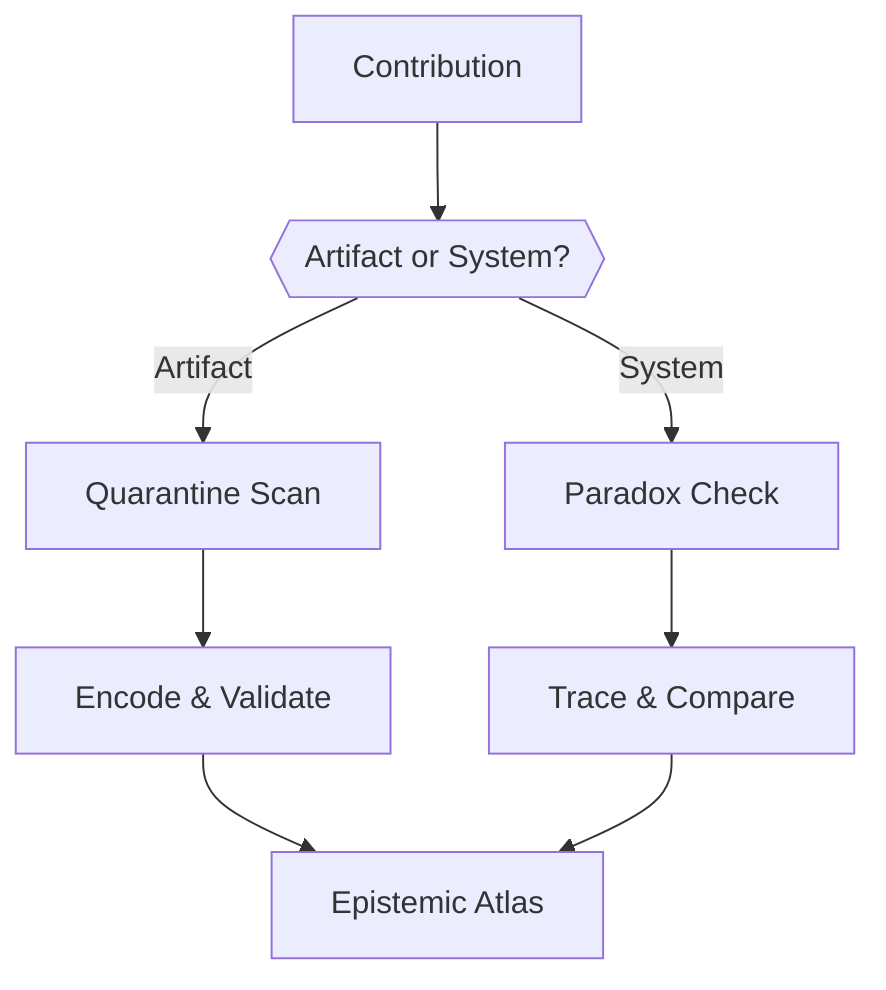
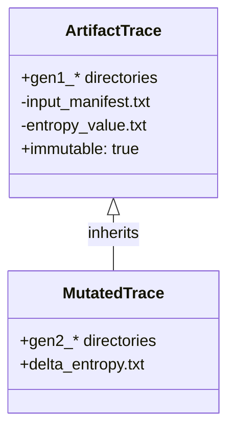
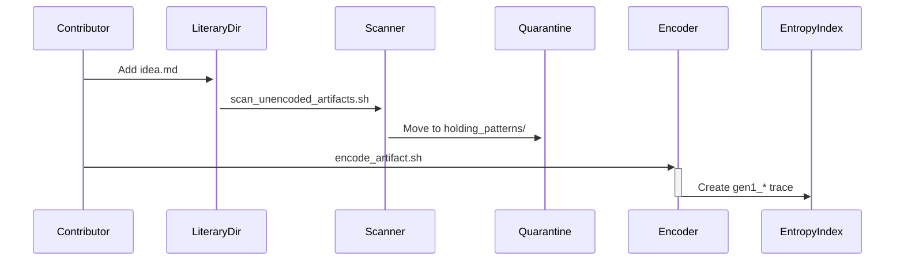
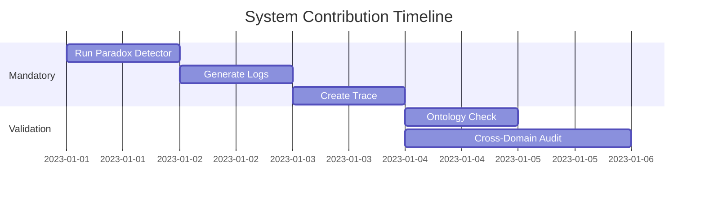
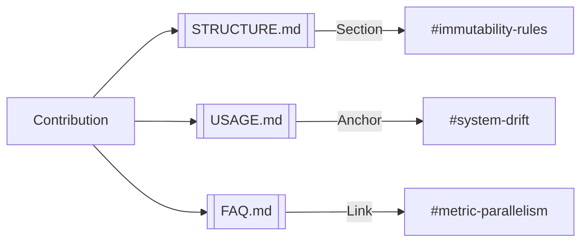

# CONTRIBUTING.md — Epistemic Integrity Protocol



---

## 🛡️ Contribution Principles

### 1. **Ontological Purity**
- **Artifacts** (literary ideas) and **System** (FSM roles) *must never intersect*  
- Use [scan_unencoded_artifacts.sh](USAGE.md#scan) before submitting raw ideas  
- System contributions require [paradox detection logs](content/specs/dialectical_cores/)  

### 2. **Gen1 Immutability**

- Never modify files under `entropy_index/artifact/gen1_*/`  
- Mutate via [mutate_artifact.sh](USAGE.md#mutation) to create new generations  

### 3. **Epistemic Firewall**
- New ideas must pass through `quarantine/holding_patterns/` ([rationale](FAQ.md#quarantine))  
- Reserved FSM role names (`ideational`, etc.) are **off-limits** for artifacts  

---

## 🧩 Contribution Workflow

### For Artifacts


### For System Code


---

## 🚨 Validation Protocol

### Pre-Submit Checks
```bash
# Validate artifact contributions
../../scripts/validate_ontology.sh --domain=artifact

# Audit system contributions
../../scripts/validate_ontology.sh --domain=system --strict
```

### Output Interpretation
| Result              | Action                               |
|---------------------|--------------------------------------|
| `✅ Ontology intact` | Ready for PR                         |
| `❌ Boundary breach` | Fix using [FAQ#firewall](FAQ.md#firewall-analogy) |
| `⚠️ Tension mismatch` | Recalibrate δ via [USAGE.md#tension](USAGE.md#artifact-encoding) |

---

## 📜 Documentation Standards

### Cross-Reference Rules

- All PRs must reference relevant documentation anchors  
- New features require [knowledge graph](OVERVIEW.md) updates  

---
### FSM Modification Protocol
1. Update FSM code  
2. Run rigidity test:  
```bash
../../scripts/test_fsm_rigidity.sh <role> <new_gen> <tension>
```
- CMS must align with FSM_WEIGHT (±20% tolerance)

- Submit trace + validation report


---
## ⚖️ Ethical Constraints

### Prohibited Actions
- Modifying SHA-256 hashes in `entropy_value.txt` post-encoding  
- Using system roles (`ideational`, etc.) as artifact names  
- Bypassing quarantine via direct writes to `entropy_index/`  

### Compliance
- Review [Ethics Charter](ETHICS.md)  
- Pass automated [integrity checks](scripts/validate_ethics.sh)  

---

```bash
# Run full validation suite
../../scripts/validate_contribution.sh --strict
```

[Begin Contribution](USAGE.md#quickstart){ .md-button }  
[Report Epistemic Breach](content/specs/ETHICS.md#reporting){ .md-button }  
