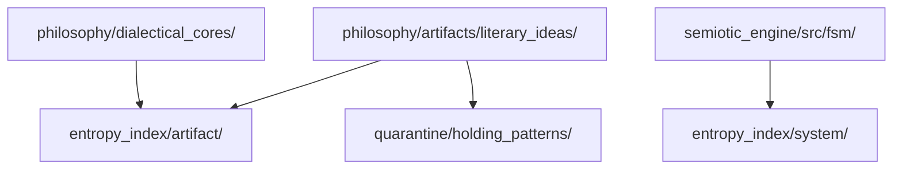
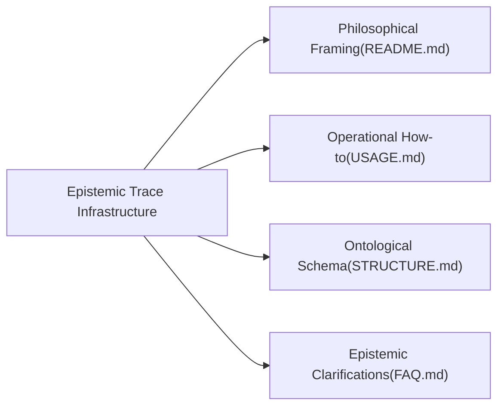
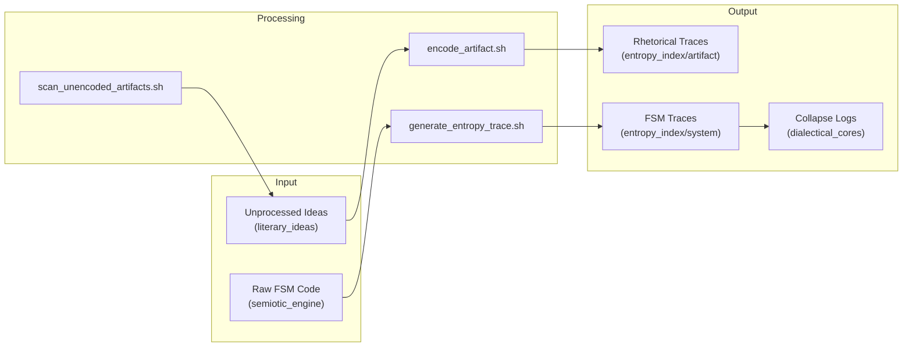
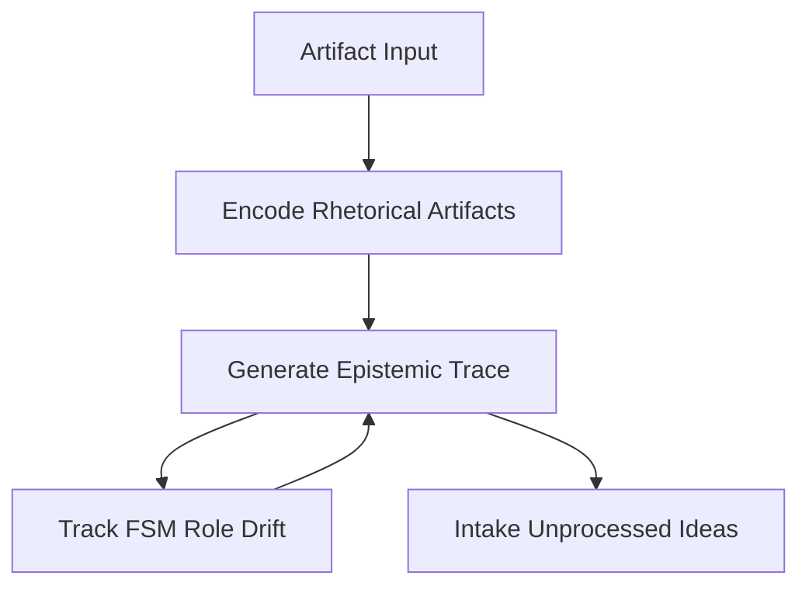

# Overview of Epistemic Trace Infrastructure

This document provides a high-level view of the system's operation, methodological layers, and structural separation. The diagrams below visually represent the overall process flow and the distinct documentation components. Click on each link to review detailed guides.

---

## Methodological Layers

This diagram shows the layers of documentation, each capturing a unique aspect of the system's epistemic identity and operation:

## Modular System Diagram

*Explanation:*  
- **Philosophical Framing (README.md):** Captures the epistemic and theoretical underpinnings.
- **Operational How-to (USAGE.md):** Details the step-by-step operational procedures.
- **Ontological Schema (STRUCTURE.md):** Maps out the system's filesystem and role hierarchies.
- **Epistemic Clarifications (FAQ.md):** Provides answers to common questions on methodology and semantic rules.

## System Integration and Workflow

This diagram illustrates how inputs, processing scripts, and outputs (stored data) interconnect within the project structure:

*Explanation:*

    Input: Represents raw inputs including unprocessed ideas (literary_ideas) and the source code for FSM roles (semiotic_engine).

    Processing: Consists of key scripts that encode ideas, generate traces, and scan for new artifacts.

    Output: Contains the resulting processed data—rhetorical traces, FSM traces, and collapse logs documenting system changes.

#### Process Flow Diagram

*Explanation:*  
- **Artifact Input:** Unencoded ideas are introduced.
- **Encode Rhetorical Artifacts:** These are processed with assigned metrics.
- **Generate Epistemic Trace:** The process outputs a trace capturing symbolic drift.
- **Track FSM Role Drift:** System roles are monitored for changes.
- **Intake Unprocessed Ideas:** Newly introduced ideas are funneled for processing.

---

