# Epistemic Trace Infrastructure Overview

This document provides a comprehensive visual and structural breakdown of the system's architecture, workflows, and methodological separation. Six Mermaid diagrams elucidate key interactions, flows, and boundaries.

---

## 📂 Directory Structure Topography


*Explanation:*  
- **literary_ideas/**: Raw, unencoded textual concepts
- **holding_patterns/**: Quarantined artifacts awaiting formalization
- **artifact/ & system/**: Encoded traces split by intentional vs emergent origins
- **dialectical_cores/**: Collapse logs from FSM role mutations

---

## 🤖 Script Responsibilities & Data Flow

```mermaid
flowchart LR
    encode[encode_artifact.sh\n📜 Symbolic Formalizer]
    generate[generate_entropy_trace.sh\n⚙️ System Drift Tracker]
    scan[scan_unencoded_artifacts.sh\n🧼 Epistemic Intake Manager]

    literary[literary_ideas/] --> scan
    scan --> holding[holding_patterns/]
    holding --> encode
    encode --> artifact_dir[entropy_index/artifact/]
    semiotic[semiotic_engine/src/fsm/] --> generate
    dialectical[dialectical_cores/] --> generate
    generate --> system_dir[entropy_index/system/]
```



*Key Interactions:*  
1. **scan** monitors literary_ideas/ → acts as intake filter
2. **encode** processes quarantined files → writes immutable Gen1 traces
3. **generate** ingests live FSM code → computes operational entropy

---

## 🧬 Artifact Encoding Sequence


*Process Guarantees:*  
- No direct writes from literary_ideas/ to entropy_index/  
- Explicit user intent required via encode_artifact.sh  
- Gen1 traces remain immutable against overwrites  

---

## 🚧 Methodological Separation of Pipelines


*Critical Boundaries:*  
- **Artifact**: User-driven, intentional claims  
- **System**: Code-derived, emergent behavior  
- **scan** enforces unidirectional flow into ArtifactPipeline  

---

## 🔥 Epistemic Firewall Mechanism


*Firewall Properties:*  
- Prevents accidental contamination of raw ideas into formal traces  
- **Red boundary**: scan acts as controlled gatekeeper  
- Mandates quarantine period for epistemic hygiene  

---

## 🧩 Mutation Driver Comparison


*Contrasting Semantics:*  
- **Artifact** mutations reflect theoretical evolution  
- **System** mutations track computational role drift  
- Dual tracing enables comparative epistemology  

---
## Collapse Metabolism Algorithm  
```python
def compute_cms(recombinations: int, collapses: int) -> float:
    total = recombinations + collapses
    return (recombinations - collapses) / total if total > 0 else 0.0
```
## Weight Alignment Logic

```mermaid
flowchart TD
    A[Declared FSM_WEIGHT] --> B{{CMS > 50?}}
    B -->|Yes| C{{FSM_WEIGHT < 0.6?}}
    B -->|No| D{{CMS < 30?}}
    C -->|Yes| E[✅ Valid]
    C -->|No| F[❌ Invalid]
    D -->|Yes| G{{FSM_WEIGHT > 0.4?}}
    G -->|Yes| E
    G -->|No| F
```



---

To visualize rhetorical vs operational evolution:  
`bash scripts/render_topography.sh --mode comparative`