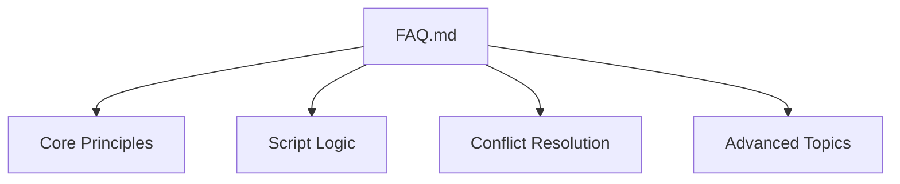
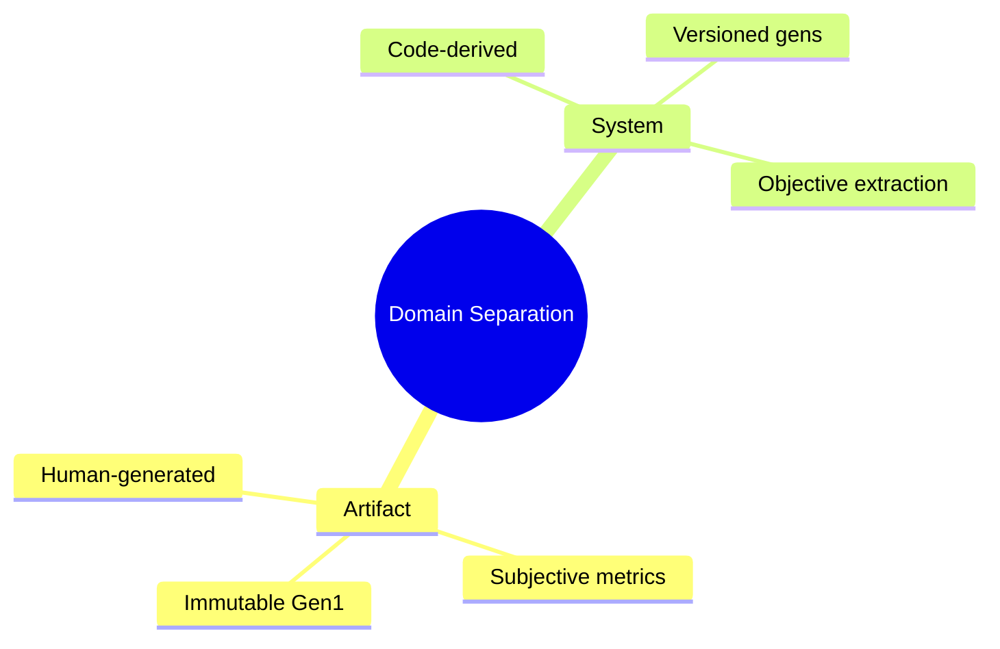
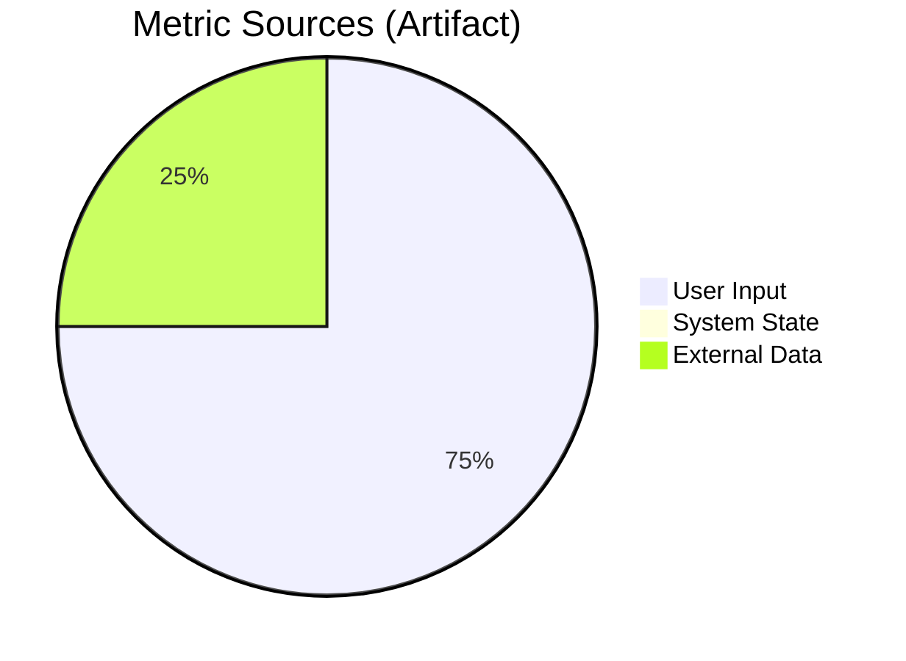
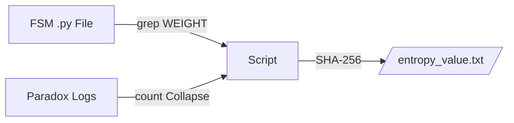
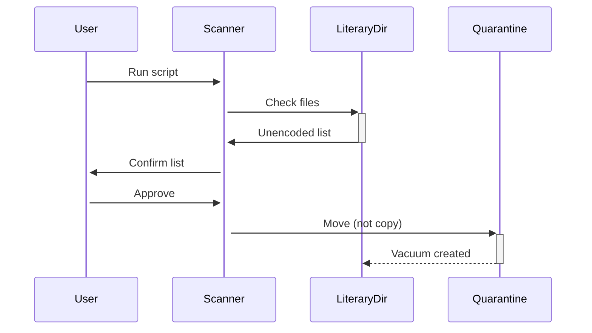
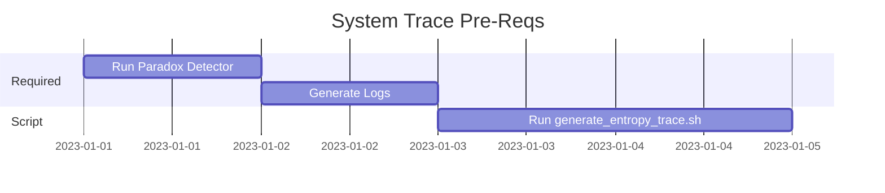
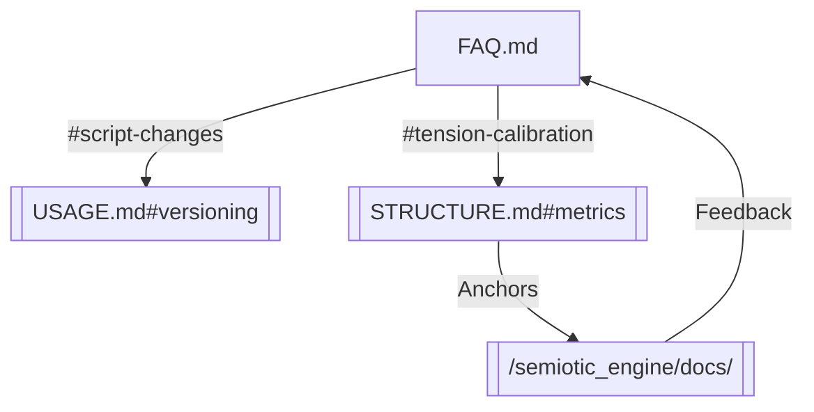

# FAQ.md — Epistemological Grounding & Methodological Clarifications

## Epistemic Operating Principles




## <a id="core-principles"></a>🔍 Core Principles

### Why quarantine artifacts before encoding?

```mermaid
flowchart LR
    Idea[Raw Idea] --> Scan{Scan}
    Scan -->|New| Quarantine[/holding_patterns/]
    Scan -->|Encoded| Block[❌ Blocked]
    Quarantine --> Encode[Formalize]
    style Quarantine stroke:#FF9800,stroke-dasharray: 5 5
```

- **Prevents Overwrite Cycles**: Ensures `literary_ideas/` remains a volatile workspace  
- **Manual Review Gate**: Requires intentional human action to formalize  
- **Mirrors Academic Peer Review**: Raw ideas ≠ published traces  

---


```mermaid
flowchart TD
    Raw[Raw Idea] --> Scan{scan_unencoded_artifacts.sh}
    Scan -->|Unprocessed| Quarantine[holding_patterns/]
    Scan -->|Already Encoded| Block[❌ Rejected]
    style Quarantine stroke:#FF9800
```

- **Prevents Ontological Contamination**: Ensures no accidental mixing of raw literary ideas with formalized traces  
- **Epistemic Hygiene**: Requires manual review before encoding (via `encode_artifact.sh`)  
- **Mirrors Peer Review**: `literary_ideas/` = preprint archive, `holding_patterns/` = under review  

---
### Why separate artifact vs system tracing?

**Prevents Category Collapse**:  
- Artifacts (`encode_artifact.sh`) use *assigned* FSM_WEIGHT  
- System roles (`generate_entropy_trace.sh`) *extract* FSM_WEIGHT from code  
- Cross-pollination would break falsifiability guarantees  

### Why can't I modify Gen1 artifact traces?
**Technical Constraint**:  
```bash
# encode_artifact.sh Line 21-24
if [[ -d "$OUTPUT_DIR" ]]; then
  echo "❌ ERROR: Gen1 is immutable" >&2
  exit 1
fi
```
**Philosophical Reason**:  
- Gen1 serves as falsifiable baseline for future mutations  
- Preserves original epistemic intent without retroactive distortion 
  
**Epistemic Rationale**:  
- Serves as falsification baseline for future mutations  
- Prevents retroactive distortion of original intent  


## <a id="script-logic"></a>🛠️ Script-Specific Logic

### encode_artifact.sh: Why user-assigned metrics?

- **FSM_WEIGHT**: Your confidence in artifact's alignment with system goals  
- **δTension**: Subjective measure of conceptual instability  
- **Collapse_Log**: Links to dialectical core logs (partial automation)  

---

### generate_entropy_trace.sh: Why code-derived weights?

- **Objective Grounding**: Weights reflect actual system state, not human interpretation  
- **Compare Semantics**: `--compare` uses bitwise Hamming distance (not symbolic diff)  

---

### scan_unencoded_artifacts.sh: Why move rather than copy?

- **Single Source of Truth**: Prevents versioning conflicts  
- **Epistemic Hygiene**: Forces "claim then commit" workflow  

---

## <a id="conflict-resolution"></a>🚨 Conflict Resolution

### "Reserved FSM name" when encoding
**Cause**:  
```bash
# encode_artifact.sh Line 14
if [[ "$ARTIFACT_NAME" =~ ^(ideational|interpersonal|textual)$ ]]
```
**Fix**:  
1. Rename artifact (e.g., `manifesto.md` → `tau_manifesto.md`)  
2. Use `generate_entropy_trace.sh` for system roles  

---

### "Missing collapse log" in system tracing
**Workflow**:  

- Always execute `semiotic_engine/paradox_detector.sh` first  

---

## <a id="advanced-topics"></a>🧩 Advanced Mechanisms

### Mutation Protocol: Artifact vs System
| Aspect              | Artifact                     | System Role               |
|---------------------|------------------------------|---------------------------|
| **Driver**          | Human (`mutate_artifact.sh`) | Code change (`--compare`) |
| **Entropy Type**    | Conceptual                   | Operational               |
| **Visualization**   | Tree diff                    | Hamming heatmap           |

---

### Validation Tools
```bash
# Check ontology compliance
../../scripts/validate_ontology.sh --strict

# Output example
✅ All artifacts in entropy_index/artifact/ are Gen1-immutable
❌ Found system trace gen3_ideational referencing deleted log
```
**Method**: Cross-references directory structure against script constraints  

---

## <a id="navigation-guide"></a>🗺️ Navigation Guide


**Deep Links**:  
- [Artifact Tension Guidelines](#artifact-tension)  
- [System Comparison Logic](#hamming-semantics)  
- [Mutation Protocol](USAGE.md#mutation-protocol)  

---

```bash
# Rebuild all documentation diagrams
../../scripts/render_docs.sh --faq
```

[Proceed to Interactive Knowledge Graph](OVERVIEW.md#knowledge-graph){:target="_blank"}  
