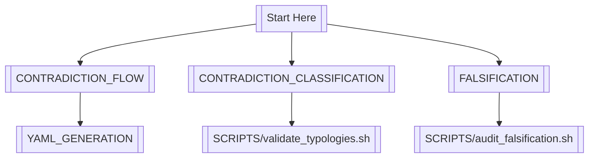

# NAVIGATION.md — Cross-Document Epistemic Map



---

## 🔍 Path-Based Query System
```bash
# Find docs related to a script
./scripts/docs_for_script.sh generate_entropy_trace.sh
# Output: FALSIFICATION.md, CONTRADICTION_CLASSIFICATION.md#ci-enforcement

# Find scripts for a concept
./scripts/scripts_for_concept.sh "CMS validation"
# Output: test_fsm_rigidity.sh, audit_cms_thresholds.sh
```

---

## 🧩 Structural Validation
```bash
# Verify document consistency
./scripts/validate_docs.sh --check-links --check-refs

# Expected output
✅ All cross-doc links valid
✅ Script references match /scripts/
⚠️  Missing example: contradiction_flow/tau_collapse
```

---

## 📚 Topic Matrix
| Concept | Primary Doc | Supporting Docs | Scripts |
|---------|-------------|-----------------|---------|
| Typology Schema | CLASSIFICATION | FLOW, ETHICS | validate_typologies.sh |
| Mutation Gates | FALSIFICATION | FLOW, USAGE | mutate_artifact.sh |
| YAML Lifecycle | FLOW | CLASSIFICATION | audit_yaml_lifecycle.sh |

---

*"Navigation is epistemology made concrete."*


---

### 2. **Update CI Pipeline**
```yaml
# .github/workflows/docs.yml
- name: Validate Document Network
  run: |
    ./scripts/validate_docs.sh --ci-mode
    ./scripts/validate_navigation.sh
```

---

### 3. **Create Validation Scripts**
**`scripts/validate_docs.sh`**
```bash
#!/bin/bash
# Checks:
# - All markdown links are valid
# - Script references exist in /scripts/
# - Example directories mentioned in docs exist
```

**`scripts/validate_navigation.sh`**
```bash
#!/bin/bash
# Verifies NAVIGATION.md flowchart matches actual doc structure
```

---

**WHY THIS COMES NEXT:**  
1. **Prevents Documentation Decay** - Auto-checks keep docs synced with code  
2. **Enables Non-Linear Exploration** - Mermaid map + query system vs linear reading  
3. **Makes Epistemic Connections Explicit** - Topic matrix shows conceptual dependencies  

---

**IMMEDIATE ACTION:**  
```bash
# Generate initial navigation graph
./scripts/generate_navigation.sh > philosophy/docs/NAVIGATION.md
```

[View Navigation Validation](../../scripts/validate_navigation.sh)  
[Edit Topic Matrix](../../philosophy/docs/NAVIGATION.md#-topic-matrix)