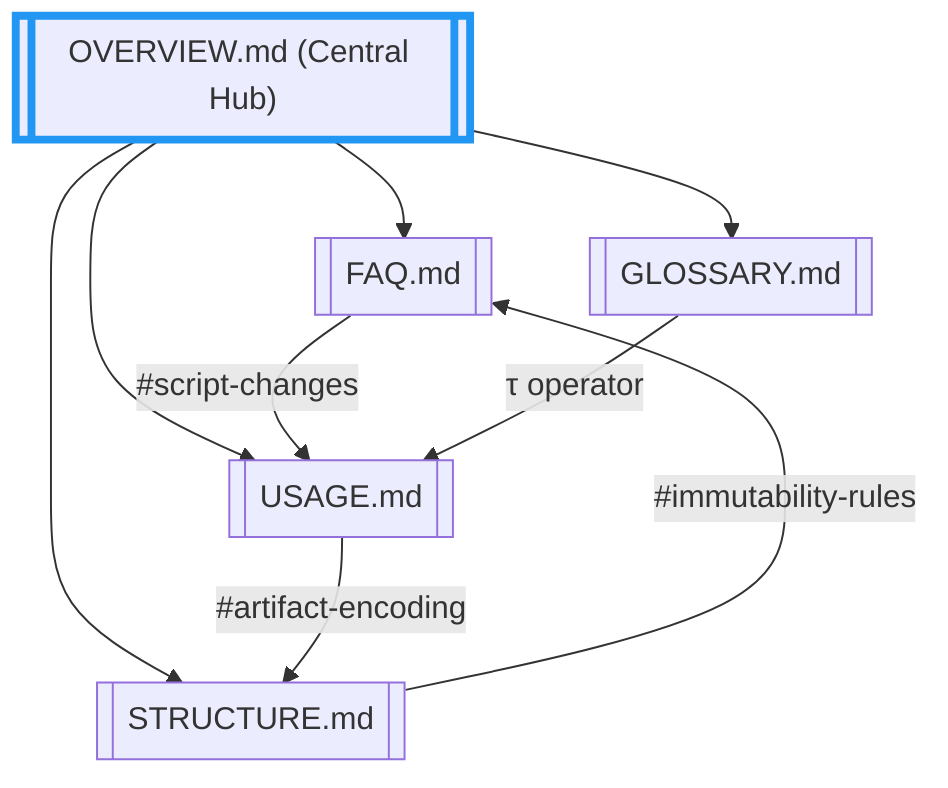
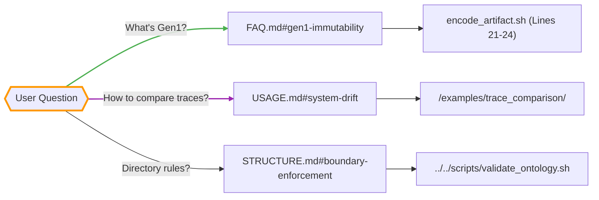
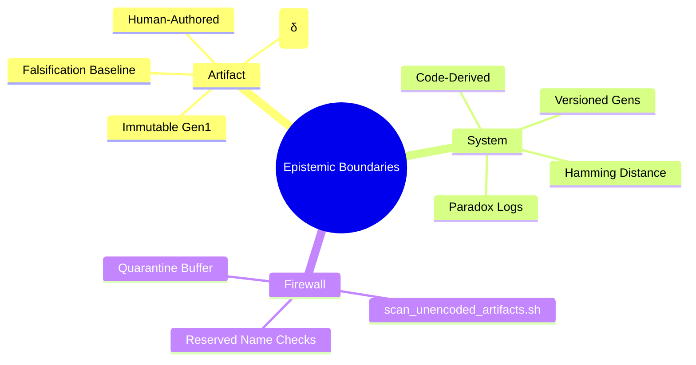
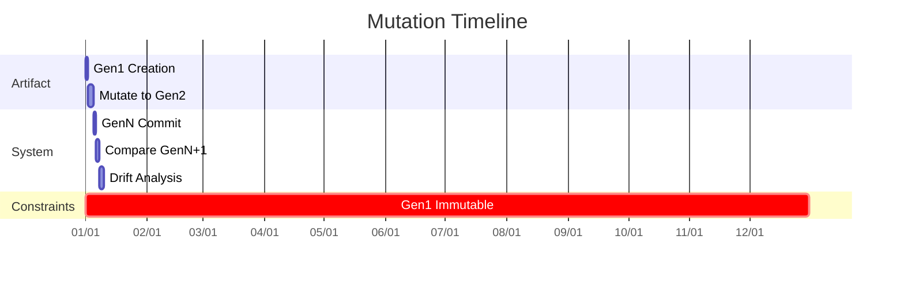
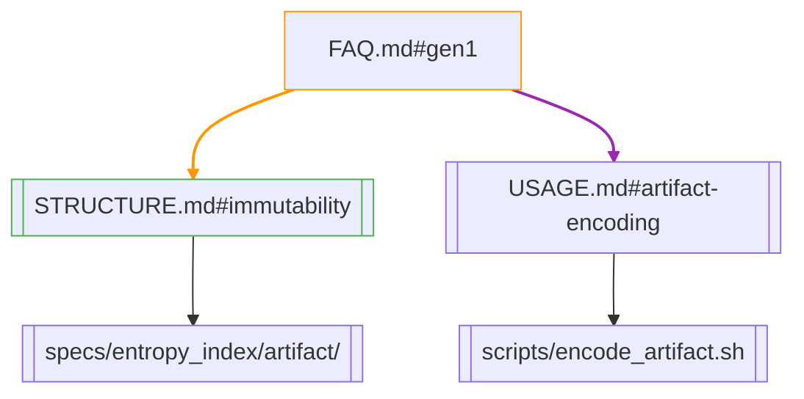
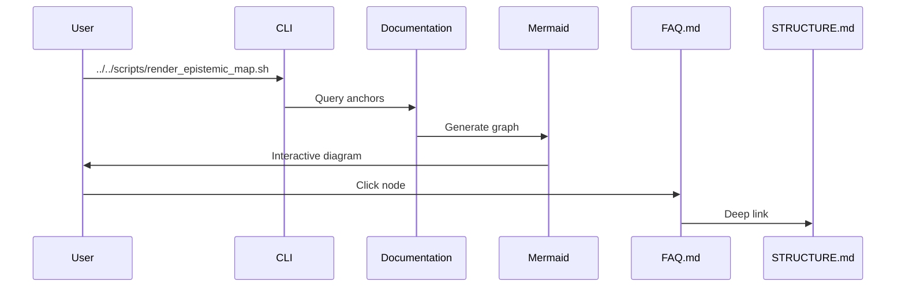
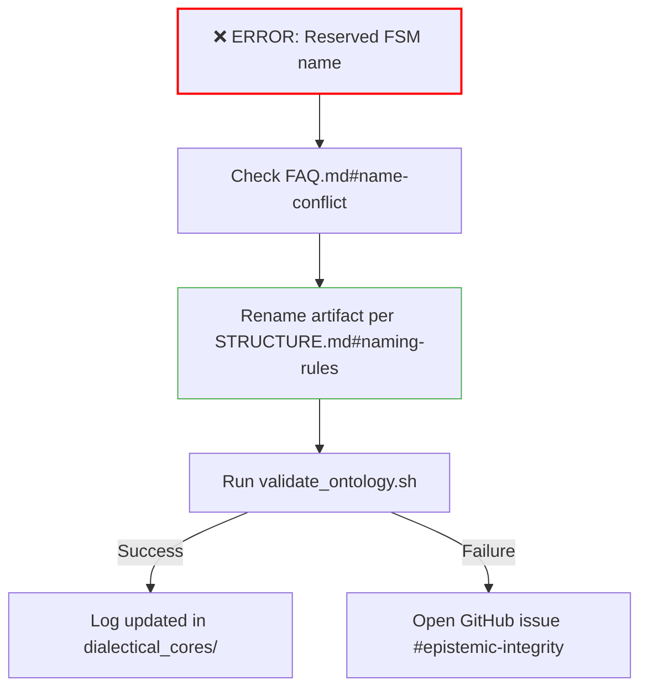

# OVERVIEW.md — System Knowledge Graph & Epistemic Topography



---

## 🌐 Knowledge Graph Topography

### Cross-Document Query System


---

## 🧩 Epistemic Boundaries

### Artifact vs System Domains


---

## 🔄 Mutation Drivers

### Trace Lifecycle


---

## 🔗 Cross-Document Anchors

### Deep Link Network


---

## 🕸️ Visual Query System

### "How do I...?" Pathways


---

## 🚨 Troubleshooting Pathway



---

## 📊 Metric Parallelism

| Dimension       | Artifact Domain              | System Domain                |
|-----------------|------------------------------|------------------------------|
| **Entropy**     | SHA-256 of user metrics      | SHA-256 of code/log state     |
| **Mutation**    | Manual (mutate_artifact.sh)  | Auto-detected (--compare)     |
| **Visualization**| Conceptual tree diff        | Hamming distance heatmap     |
| **Immutable**   | Gen1                        | No — gens evolve             |

---

## ▶️ Navigational Commands
```bash
# Launch interactive knowledge graph
../../scripts/launch_knowledge_graph.sh --layers=3

# Example output
🌐 Epistemic Graph Loaded:
- FAQ.md#gen1 ↔ STRUCTURE.md#immutability
- USAGE.md#system-drift ↔ scripts/generate_entropy_trace.sh
```

[Begin Exploration](FAQ.md#navigation-guide){ .md-button } 
[Validate Structure](STRUCTURE.md#boundary-enforcement){ .md-button }
