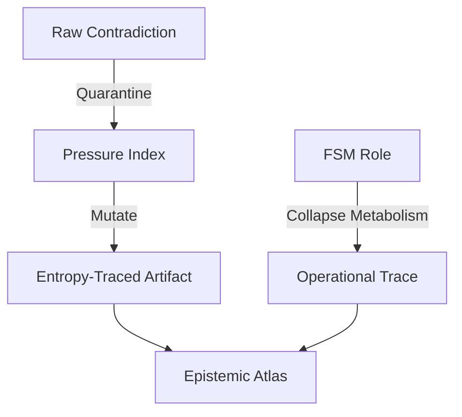
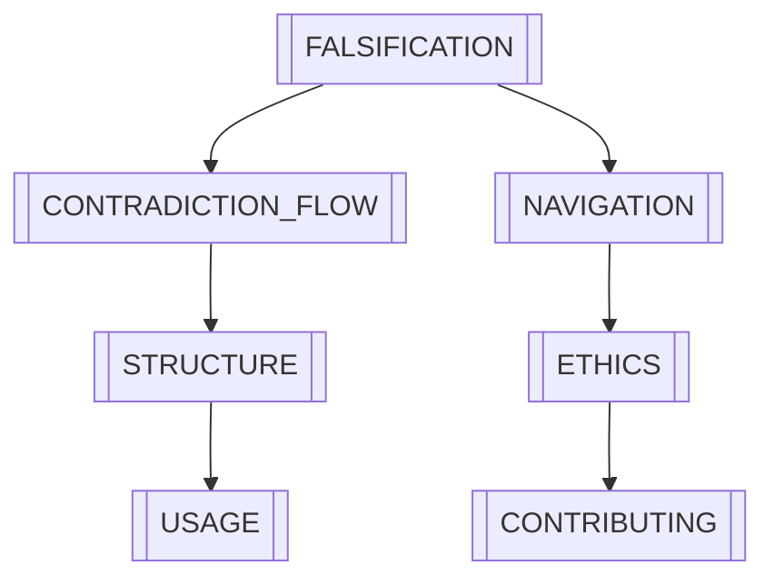

# 🧠 README.md 
    _Epistemic Trace Infrastructure_

[](docs/FALSIFICATION.md)
[](docs/CONTRADICTION_FLOW.md)

Formalize recursive epistemology through contradiction metabolism tracking and entropy-constrained mutation.



## 🌐 Core Invariants

### Dual Falsification Axes
| Axis | Mechanism | Validation |
|------|-----------|------------|
| **Artifact** | δTension vs CMS | `validate_tension_cms.sh` |
| **System** | ΔEntropy vs Weight | `audit_weight_entropy.sh` |

### Key Features
- **Contradiction Metabolism Scoring**: Quantify paradox resolution capacity  
- **Immutable Pressure Logs**: YAML-encoded mutation justifications  
- **Epistemic Firewalls**:  
  - No raw→trace direct writes  
  - No cross-domain entropy mixing  

---

## 🛠️ Mutation Pipeline

### Core Workflow

```mermaid
flowchart LR
    A[📥 literary_ideas/] -->|Scan| B[📦 quarantine/]
    B -->|Encode| C[📜 entropy_index/artifact/]
    C -->|Mutate| D[🌀 genN_trace/]
    E[⚙️ semiotic_engine/] -->|Trace| F[📡 entropy_index/system/]
    D --> G[🗃️ contradictions/library/]
```


### Key Scripts
| Script | Domain | Enforced Boundary |
|--------|--------|--------------------|
| `encode_artifact.sh` | Artifact | Quarantine firewall |
| `generate_entropy_trace.sh` | System | FSM role isolation |
| `test_fsm_rigidity.sh` | Validation | CMS thresholds |

---

## 🚀 Getting Started

### 1. Encode with Contradiction Pressure
```bash
# Create and process new idea
nano philosophy/artifacts/literary_ideas/tau_collapse.md
../../scripts/contradiction_pipeline.sh tau_collapse
```

### 2. Track System Metabolism
```bash
# Generate and compare role traces
../../scripts/generate_entropy_trace.sh ideational gen1 3.8
../../scripts/generate_entropy_trace.sh ideational gen2 4.2 --compare
```

[Full Contradiction Workflow](docs/CONTRADICTION_FLOW.md) | [Troubleshooting](docs/FAQ.md#breach-recovery)

---

## 📜 Documentation Topography



---

## 🔬 Contribution Protocol

### Mutation Preconditions
1. Contradiction pressure file exists  
2. CMS within weight bracket  
3. No unresolved breaches  

```bash
# Validate before committing
../../scripts/precommit_scan.sh --full

# Audit trace lineage
../../scripts/audit_trace_lineage.sh --gen=all
```

[Full Contribution Guide](docs/CONTRIBUTING.md) | [Ethical Constraints](docs/ETHICS.md)

---

## 🔍 Explore the Atlas

```bash
# Launch interactive knowledge graph
../../scripts/launch_epistemic_atlas.sh --mode=full

# Generate trace topography
../../scripts/render_topography.sh --artifact=gen2_tau --system=gen3_ideational
```

---

*"What we cannot falsify, we must not formalize."*  
