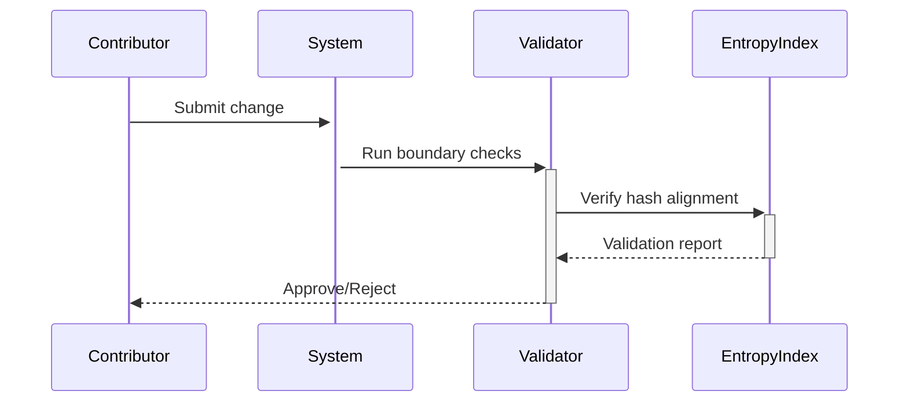

# STRUCTURE: Separation of Concerns Protocol

## 🧭 Purpose
Enforce boundaries between symbolic domains to prevent ontological collapse. This document defines **falsifiable constraints** for maintaining epistemic integrity across rhetorical, operational, and interpretive layers.

---

## 🔗 Domain Ontology

### Core Namespaces
| Domain | Path | Mutability | Mutation Tool | Validation |
|--------|------|------------|---------------|------------|
| **Raw Input** | `/artifacts/raw_inputs/` | Uncontrolled | None | Manual review |
| **Formal Artifacts** | `/philosophy/entropy_index/artifact/` | Gen1-immutable | `encode_artifact.sh` | SHA-256 manifest |
| **System Roles** | `/philosophy/entropy_index/system/` | Versioned | `generate_entropy_trace.sh` | Hamming distance |
| **FSM Logic** | `/semiotic_engine/src/fsm/` | Code-mutable | Direct edits | `test_fsm_rigidity.sh` |
| **Quarantine** | `/philosophy/quarantine/` | Ephemeral | `scan_unencoded_artifacts.sh` | Timestamp audit |
| **Breaches** | `/philosophy/breach/breach_logs/` | Append-only | Automated detectors | Immutable hashes |

---

## 🔐 Boundary Enforcement

### Absolute Prohibitions
1. **No Cross-Domain Writes**
   ```bash
   # ❌ Invalid: System tool writing to artifact space
   generate_entropy_trace.sh textual gen1 2.3 --output ../entropy_index/artifact/
   ```
   **Response**: Auto-log to `breach_logs/` and halt execution

2. **No Raw-to-Formal Bypass**
   ```mermaid
   flowchart LR
       A[raw_inputs/] -->|Must pass through| B[quarantine/]
       B -->|Formalize via| C[encode_artifact.sh]
       style A stroke:#ff0000
   ```

3. **No Weight/Artifact Contamination**
   - FSM role names (`ideational`, etc.) forbidden in artifact IDs
   - Artifact tension metrics never influence FSM weight calculations

---

## 🧪 Validation Workflow

### Daily Boundary Checks
```bash
# Verify namespace purity
./scripts/validate_topography.sh --strict

# Expected output
✅ Artifact domain: 0 foreign entities
✅ System domain: 0 rhetorical traces
❌ Quarantine: 2 unprocessed files (logged)
```

### Post-Mutation Audit


---

## 🚨 Violation Examples

### Category Error
```bash
# Attempting to encode FSM role as artifact
./scripts/encode_artifact.sh semiotic_engine/src/fsm/ideational.py
```
**Automated Response**:
```text
❌ Structural violation: FSM role detected in artifact pipeline
Logged to: breach/breach_logs/20231015-1423_ideational_contamination.md
```

### Protocol Bypass
```bash
# Manual write to entropy_index/artifact/
cp raw_idea.md philosophy/entropy_index/artifact/gen1_illegal/
```
**Detection**: SHA-256 mismatch during next validation run

---

## 🧠 Design Rationale

### Why Three-Tier Separation?
1. **Falsifiability** - Clear failure modes when boundaries break
2. **Mutation Tracking** - Artifacts vs system roles evolve differently
3. **Containment** - Raw inputs can't corrupt formalized traces

### Metric Independence
| Domain | Primary Metric | Source |
|--------|----------------|--------|
| Artifact | δTension | Human-assigned |
| System | CMS | Code/log-derived |
| FSM | WEIGHT | Declared in source |

---

## 📜 Related Protocols
- [Weight Verification](verification/weights.md)
- [Ethical Constraints](ETHICS.md#accountability-framework)
- [Mutation Tracking](USAGE.md#generation-workflows)

---

**This document is epistemically binding.**  
Violations render traces non-falsifiable and must be purged.


