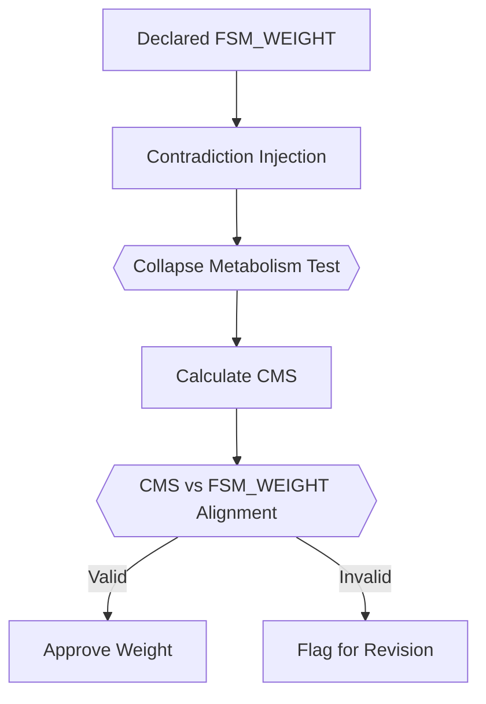
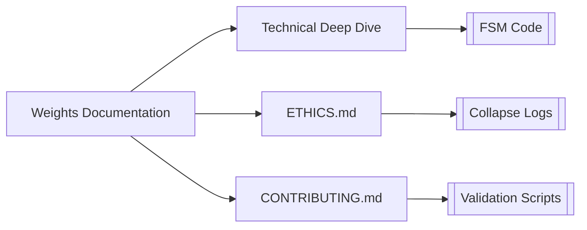

# FSM Weight Verification Protocol



---

## 🔍 Verification Criteria (Iteration 3)

### 1. Weight-Rigidity Correlation Test  
**Objective**: Validate that `FSM_WEIGHT` matches observed collapse/recombination behavior.  

**Process**:  
```bash
# Run rigidity harness
../../scripts/test_fsm_rigidity.sh ideational gen5 2.8

# Expected Output
⚙️ Recombination: 2  
💥 Collapse: 0  
🧠 Collapse Metabolism Score: 66  
📏 FSM Weight: 0.4  
✅ FSM_WEIGHT matches observed collapse metabolism
```

**Validation Rules**:  
| FSM_WEIGHT Range | Expected CMS | Tolerance |  
|-------------------|--------------|-----------|  
| 0.0–0.3          | CMS ≥ 70     | ±10%      |  
| 0.4–0.6          | CMS 40–60    | ±15%      |  
| 0.7–1.0          | CMS ≤ 30     | ±5%       |  

---

## 🧮 Mathematical Relationship

### CMS-Weight Formula
```math
\text{Expected CMS} = 100 \times (1 - \text{FSM\_WEIGHT}) \pm \text{Tolerance}
```

**Example**:  
- Declared Weight: `0.8` → Expected CMS: `20 ±5`  
- Observed CMS: `25` → **Valid**  
- Observed CMS: `35` → **Invalid**  

---

## 🛠️ Verification Workflow

### Step 1: Baseline Entropy Trace
```bash
../../scripts/generate_entropy_trace.sh interpersonal gen6 3.1
```

### Step 2: Stress Test Execution  
```python
# semiotic_engine/src/verification/contradiction_injector.py
inputs = ["affirm", "deny", "reaffirm", "negate_self"]
for cmd in inputs:
    output = run_fsm_with_input(role, cmd)
    log_collapse_events(output)
```

### Step 3: Automated Validation  
```bash
# Check weight compliance
../../scripts/validate_weights.sh --role=ideational --gen=gen5

# Output
✅ ideational (gen5): CMS=62 vs Expected=60±15 (W=0.45)
```

---

## 🚨 Common Verification Failures

| Failure Mode | Detection Method | Fix |  
|--------------|-------------------|-----|  
| Silent error suppression | `grep "error" out1.txt` count vs logs | Enable strict FSM error reporting |  
| CMS-Weight mismatch | Compare `cms_score.txt` vs `input_manifest.txt` | Recalibrate weight or improve recombination logic |  
| Collapse underreporting | Cross-check `dialectical_cores/` logs | Update paradox detector |  

---

## 📜 Versioned Verification

### Weight Audit Trail
```bash
philosophy/entropy_index/system/gen5_ideational/
├── weight_validation.md
└── audit_trail/
    ├── version1_weight_0.7.md
    └── version2_weight_0.4.md  # Approved after CMS fix
```

### Audit File Template  
```markdown
# Weight Revision Audit: ideational → gen5

## Rationale for Change
- Initial CMS: 28 (too rigid for W=0.7)  
- Adjusted to W=0.4 → CMS=62  

## Evidence
- [Contradiction Test Logs](./out1.txt)  
- [Entropy Drift Analysis](../gen4_comparison.md)  
```

---

## 🔗 Integrated Validation



[View Weight Change Example](../../semiotic_engine/examples/weight_evolution/)  
[Ethical Constraints](../ETHICS.md#prohibited-testing-practices)  
