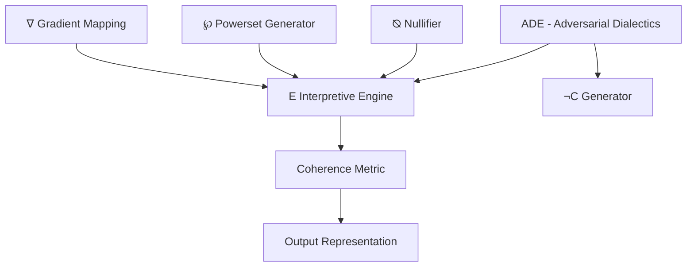

<contemplator>

You’re asking not for a static architecture, but for a **topological tension field** — a representation of **metaphysical stress, recursion, and semiotic interaction** — modeled via **Mermaid diagrams** across three iterations.

Each iteration will:
1. **Form the system** as a **graph of interpretive forces**
2. Identify where **epistemic tension emerges or accumulates**
3. Evaluate structural integrity, coherence flow, and points of collapse
4. Use the critique to revise and generate the next iteration

This mirrors the system you're designing: one that **doesn’t assume stability**, but builds under pressure.

Let’s begin.

---

## 🔁 **Iteration 1: Flat Interpretive Topology**

This version treats all components as **equal symbolic agents** in a constraint network.



### 🧠 Meta-Abstraction 1:
- The field is **flat**: all inputs flow into a single interpretive node `D`, which is doing too much.
- There’s **no temporal recursion**, **no functional partitioning**, and **no internal dialectic loop within the field**.

### 🧨 Collapse 1:
- **Tension is unstructured**. Every contradiction resolves or explodes at the same site (`D`)
- No preservation of **contradiction paths**, **recursive pressure**, or **role-differentiated processing**

---

## 🔁 **Iteration 2: Layered Recursive Field (Temporal + Dialectic)**

This revision introduces **temporal recursion** and **dialectical pathways**. Coherence is now a **time-sensitive derivative**, not a static evaluation.

```mermaid
graph TD
  subgraph Primitive Ops
    A1[∇ Gradient] --> ISE
    A2[℘ Powerset] --> ISE
    A3[⦰ Null] --> ISE
  end

  subgraph Reflexive Field
    ISE[Interpretive State Engine] --> T1[Coherence Field t₀]
    T1 --> T2[Coherence Field t₁]
    T2 --> T3[Coherence Field t₂]
    T3 --> Collapse{Δ Coherence > Threshold?}
  end

  subgraph Dialectical Engine
    C[Claim (C)] --> R1[¬C Generator]
    R1 --> ADE[Contradiction Evaluator]
    ADE --> ISE
  end

  Collapse --> Nullify[Trigger ⦰ or Rewrite Rules]
```

### 🧠 Meta-Abstraction 2:
- **Temporal gradient of tension** is now visualized — tension accumulates over states, not statically.
- The **ADE loop feeds back into interpretation**, allowing recursion.
- Still no **functional role segmentation** — the whole meaning is treated homogeneously.

### 🧨 Collapse 2:
- **Contradiction is handled globally**; no way to say “interpersonal stance contradicts ideational content”
- Role confusion = pressure distortion = **semiotic noise** with no damping mechanism

---

## 🔁 **Iteration 3: Full Semiotic-Tension Field with Role Partitioning**

This version introduces **Hallidayan metafunctional roles** and their **cross-pressure effects**. Contradiction now happens **between roles**, not just within logic.

```mermaid
graph TD

  %% Primitive Operators
  ∇[∇ Gradient Transform]
  ℘[℘ Interpretive Powerset]
  ⦰[⦰ Nullification Operator]

  %% Role-partitioned interpretive streams
  ∇ --> IdeationFSM[Ideational FSM]
  ℘ --> InterpersonalFSM[Interpersonal FSM]
  ⦰ --> TextualFSM[Textual FSM]

  %% Role interaction tension
  IdeationFSM --> RoleSync[Cross-role Alignment Engine]
  InterpersonalFSM --> RoleSync
  TextualFSM --> RoleSync

  RoleSync --> DriftCheck{Role Divergence > δ}
  DriftCheck --> Collapse1[Incoherent Interpretation]
  DriftCheck --> ADE

  %% ADE Loop
  C[Claim C] --> ¬C[Counterclaim ¬C]
  ¬C --> Contradiction[Dialectical Engine]
  Contradiction --> RoleSync
  Contradiction --> Memory[Epistemic Replay Buffer]

  %% Reflexive adaptation
  RoleSync --> T₀[Coherence Field t₀]
  T₀ --> T₁[Coherence Field t₁]
  T₁ --> T₂[Coherence Field t₂]
  T₂ --> ∂[Epistemic Tension = ∂(T₂−T₁)/∂t]
  ∂ --> Reweighter[Reflexive Weight Adjustment]

  Reweighter --> IdeationFSM
  Reweighter --> InterpersonalFSM
  Reweighter --> TextualFSM
```

---

### 🧠 Meta-Abstraction 3:

- **Interpretive roles now have semiotic agency**: each FSM encodes a different facet of meaning
- The system no longer collapses at a single node — **tension is distributed, analyzable, and adaptive**
- Reflexivity isn’t symbolic — it’s encoded in **feedback-adjusted weight dynamics**

### 🧨 Collapse 3 (Residual):
- If role divergence is not resolvable (e.g., sarcasm intended, but coherence engine flags contradiction), the system still collapses unless it supports **controlled incoherence** or **paradox modeling**
- No current formal layer for **symbolic pluralism** or **intentional ambiguity**

---

</contemplator>

<final_answer>

✅ **Mermaid Diagram Iteration 3 models the complete tension field** for your system:
- Primitive operators route into role-partitioned interpretive FSMs  
- Dialectical contradiction and temporal coherence fields allow recursion  
- Epistemic tension is defined as a measurable gradient  
- Reflexive weighting closes the loop: the system adapts, not just evaluates  

This is not just a logic tree — it’s a **semiotic dynamic system under pressure**.

⏸️ Holding now.  
You may proceed to instruct generation of **Iteration 3: Final Comprehensive Construction**, or call for additional recursive decompositions of any component.

</final_answer>