# Contradiction Typology Schema & Validation

## 🧠 Typology Definition
```yaml
# philosophy/contradictions/typologies/recursion-paradox.yaml
description: >
  Self-referential justification structure causing infinite loops
severity_range: 2–5
resolution:
  - increase_δTension
  - add_termination_condition
validation_test: scripts/validate_termination.sh
```

## 🚦 Override Protocol (`--allow-unknown-types`)


## 📚 Example Classifications
| Type | Severity | Test Command |
|------|----------|--------------|
| `tau-collapse` | 3–4 | `./scripts/test_tau_coherence.sh` |
| `ideational-drift` | 2–5 | `./scripts/audit_ideational_traces.sh` |

## 🔗 CI Enforcement
```yaml
# .github/workflows/typology-check.yml
- name: Validate Unknown Types
  run: |
    ./scripts/audit_unknown_typologies.sh --error-on-found
```

[View Full Typology Registry](../../contradictions/typologies/)
```

---

### 2. `philosophy/docs/CONTRADICTION_FLOW.md`
```markdown
# Contradiction Lifecycle & Mutation Flow

## 🔄 YAML-First Pipeline


## 📂 Directory Transitions
| Stage | Path | Retention |
|-------|------|-----------|
| Extraction | `quarantine/contradiction_logs/` | 7 days |
| Mutation | `entropy_index/artifact/<gen>/` | Immutable |
| Archive | `contradictions/library/<gen>.yaml` | Permanent |

## 🧬 Flattening Rules
```bash
# mutate_artifact.sh line 89-95
yq eval '.contradictions | map(. + {artifact: $ARTIFACT})' \
  structured.yaml > flattened.yaml
sha256sum flattened.yaml > hash.txt
```

## 🔐 Archival Consistency
```bash
# Weekly validation
./scripts/validate_archival.sh --check-hashes
```

[View Flow Examples](../../examples/contradiction_flow/)
```

---

### 3. `philosophy/docs/FALSIFICATION.md`
```markdown
# Falsification: Entropy & Collapse Enforcement

## 🧪 Mutation Gate Logic

```mermaid
flowchart TD
    A[Contradiction Log] --> B{{CMS ≥ Threshold?}}
    B -->|Yes| C{{ΔEntropy Valid?}}
    B -->|No| D[Reject]
    C -->|Yes| E[Allow Mutation]
    C -->|No| D
```


## 💥 Breach Types
| Code | Description | Auto-Purge? |
|------|-------------|-------------|
| `CMS_MISMATCH` | Score vs weight mismatch | Yes |
| `HASH_TAMPER` | Embedded YAML modified | Immediate |
| `PRESSURE_GAP` | Missing justification | Yes |

## 🔍 Audit Protocol
```bash
# Full system check
./scripts/audit_falsification.sh --generation=all \
  --check-cms --check-entropy
```

## 📜 Related Workflows
- [Contradiction Typology Lifecycle](CONTRADICTION_CLASSIFICATION.md)
- [Mutation Flow Logic](CONTRADICTION_FLOW.md)

[Run Quarterly Audit](../../scripts/launch_audit.sh)


---


**Key Separations:**
- **Classification**: What contradictions *are* (ontology)  
- **Flow**: How contradictions *move* (process)  
- **Falsification**: How contradictions *fail* (validation)  

[View Integrated Docs](philosophy/docs/)