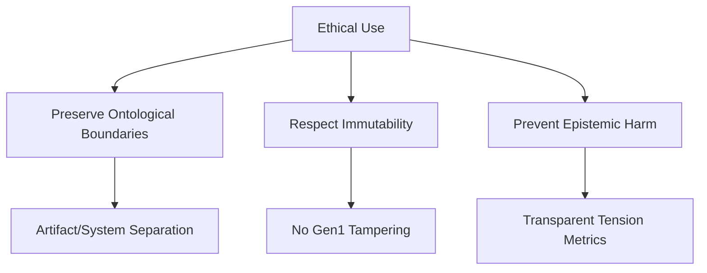
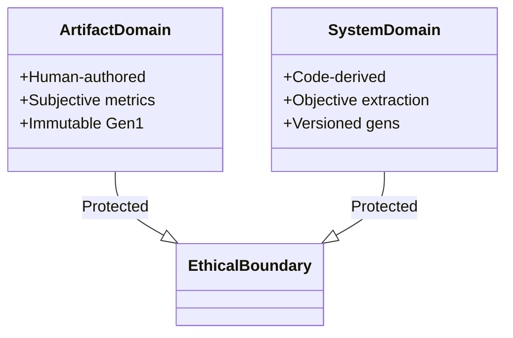
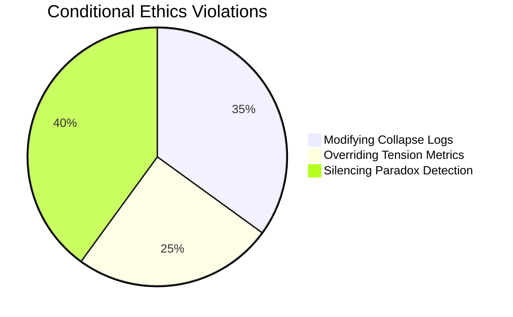
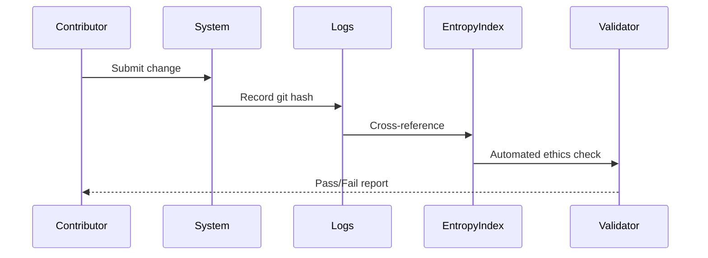
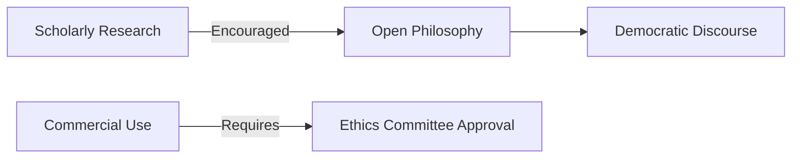

# ETHICS.md — Epistemic Integrity Charter



---

## 🛡️ Principles of Ethical Conduct

### 1. **Ontological Non-Contamination**

- Never intentionally blur artifact/system boundaries  
- Report accidental overlaps via [breach protocol](#reporting-breach)  

### 2. **Trace Immutability Covenant**
- **Gen1 Traces**: Sacred baseline for falsifiability  
- **Prohibited**:  
  ```bash
  # ANY modification to gen1_* directories
  rm -rf entropy_index/artifact/gen1_*
  sed -i '...' entropy_index/artifact/gen1_*/interpretation.md
  ```

### 3. **Metric Transparency**
- Disclose all δTension calibration methods in [interpretation.md](USAGE.md#interpretation-files)  
- Document FSM weight sources in [semiotic_engine/docs/](semiotic_engine/docs/weights.md)  

---

## 🚫 Prohibited Actions

### Absolute Taboos
| Action | Consequence | 
|--------|-------------|
| Forging SHA-256 hashes | Permanent ban from contribution |
| Bypassing quarantine | Blacklist of all related artifacts |
| Using system roles as artifacts | Ontological purge procedure |

### Conditional Restrictions

## Prohibited Testing Practices  
❌ Artificially inflate CMS via:  
   - Silent error suppression in FSMs  
   - Overreporting recombinations  
❌ Manipulate weight alignment thresholds  
---

## 🔍 Accountability Framework

### Traceability Requirements


### Audit Process
1. **Monthly**: Automated [ontology validation](CONTRIBUTING.md#validation-protocol)  
2. **Quarterly**: Human-led [epistemic audit](philosophy/audit/audit_protocol.md)  
3. **Ad Hoc**: Triggered by [threshold breach](#thresholds)  

---

## 🌍 Societal Responsibility

### Preventative Measures
- **Avoid Weaponization**: Never use entropy traces to:  
  - Manipulate consensus reality perception  
  - Erase competing philosophical frameworks  
- **Bias Mitigation**:  
  ```bash
  # Run bias detection
  ../../scripts/detect_bias.sh --domain=artifact
  ../../scripts/detect_bias.sh --domain=system
  ```

### Beneficial Use Mandate


---

## 🚨 Reporting Breaches

### Thresholds
| Severity Level | Response Time | Action |
|----------------|---------------|--------|
| **Minor** (Accidental quarantine bypass) | 7 days | Retraining |  
| **Major** (Gen1 tampering attempt) | 24 hours | System-wide rollback |  
| **Critical** (Ontological collapse risk) | 1 hour | Full epistemic lockdown |

### Reporting Protocol
1. **Immediate Action**:  
   ```bash
   # Freeze affected domain
   ../../scripts/lockdown.sh --domain=artifact --reason="breach"
   ```
2. **Notify**:  
   - Ethics Committee: kebekad673@proton.me  
   - Security Lead: kebekad673@proton.me
3. **Document**: File breach report in [philosophy/breach/breach_logs/](philosophy/breach/breach_logs/)

---

```bash
# Verify ethical compliance
../../scripts/validate_ethics.sh --full
```


