# FALSIFICATION: Entropy Validation & Breach Protocols

```mermaid
flowchart TD
    A[ΔEntropy] --> B{{CMS Threshold}}
    B -->|Valid| C[Mutation Approved]
    B -->|Invalid| D[Breach Logged]
    D --> E[Trace Purged]
```



---

## 🌀 Entropy Drift Validation

### Hamming Distance Calculation
```python
def hamming_delta(gen1_hash, gen2_hash):
    return bin(int(gen1_hash, 16) ^ int(gen2_hash, 16)).count('1')
```

**Validation Rules**:
- ≤10 bits drift: Normal mutation  
- 11-25 bits: Flag for review  
- >25 bits: Auto-purge trace  

---

## 📉 Collapse Metabolism Score (CMS)

### Calculation Formula
```math
CMS = \frac{\text{Recombinations} - \text{Collapses}}{\text{Total Contradictions}} \times 100
```

### Weight-CMS Matrix
| FSM_WEIGHT | Valid CMS Range | Lock Threshold |  
|------------|-----------------|----------------|  
| 0.9        | 0-15            | CMS > 20       |  
| 0.7        | 0-30            | CMS > 35       |  
| 0.5        | 20-60           | CMS <15 or >65 |  
| 0.3        | 50-90           | CMS < 45       |  

**Example**:  
```bash
# test_fsm_rigidity.sh output
⚙️ Recombinations: 8 | 💥 Collapses: 2 | 🧠 CMS: 60
📏 FSM_WEIGHT: 0.4 → ❌ Threshold breach (max 60 at W=0.5)
```

---

## 🚧 Mutation Gate Enforcement

### Preconditions
1. Parent CMS within weight bracket  
2. Contradiction YAML has valid hash chain  
3. ΔEntropy ≤ declared tension × 5  

```mermaid
flowchart TD
    A[Start Mutation] --> B{{CMS Check}}
    B --> C{{ΔEntropy Check}}
    C --> D{{YAML Validation}}
    D --> E[Write New Gen]
    B -->|Fail| F[Log Breach]
    C -->|Fail| F
    D -->|Fail| F
```



---

## 🚨 Breach Types & Responses

| Breach Code | Description | Auto-Purge? |  
|-------------|-------------|-------------|  
| CMS_MISMATCH | Score vs weight mismatch | Yes (1hr) |  
| HASH_TAMPER | Manifest/SHA-256 mismatch | Immediate |  
| PRESSURE_GAP | Missing contradiction YAML | Yes (24hr) |  
| TENSION_DRIFT | ΔEntropy > 5×δTension | Yes |  

**Recovery Workflow**:
```bash
# 1. Identify affected traces
./scripts/find_contaminated.sh --breach=CMS_MISMATCH

# 2. Quarantine traces
./scripts/purge_traces.sh --dry-run # Review first
./scripts/purge_traces.sh --confirm --breach=CMS_MISMATCH

# 3. Rebuild from last valid gen
./scripts/rebuild_trace.sh --from-gen=genX
```

---

## 🔍 Audit System

### Core Scripts
```bash
# Full trace integrity check
./scripts/check_trace_integrity.sh --gen=all

# CMS threshold validation
./scripts/audit_cms_thresholds.sh --report

# Entropy drift analysis
./scripts/analyze_entropy_drift.sh --heatmap
```

### Quarterly Audit Protocol
1. Run full validation sweep  
2. Generate breach postmortems  
3. Update weight-CMS matrix if needed  
4. Purge non-recoverable traces  

```bash
# Initiate audit
./scripts/launch_audit.sh --year=2023 --quarter=Q4
```

---

## 📜 Related Documents
- [Contradiction Typology Rules](CONTRADICTION_CLASSIFICATION.md)  
- [YAML Lifecycle Flow](CONTRADICTION_FLOW.md)  
- [Ethical Enforcement](ETHICS.md#breach-response)  

---

```bash
# Check current breach state
./scripts/breach_status.sh --summary
```

*"A system that cannot falsify its mutated traces cannot claim epistemic rigor."*  
