# 🧠 Epistemic Trace Infrastructure

[](docs/STRUCTURE.md)
[](FAQ.md)

Formalize rhetorical and computational structures as symbolic epistemic traces — subject to recursive mutation, entropy drift, and dialectical collapse analysis.


## 🌐 Core Concepts

### Dual Ontological Planes
| **Artifact Domain** (Human)        | **System Domain** (Machine)       |
|------------------------------------|-----------------------------------|
| Literary ideas → gen1 traces       | FSM code → versioned traces       |
| Mutated intentionally              | Drifts operationally              |
| SHA-256 of human metrics           | SHA-256 of code/log state         |
| [Encode Guide](USAGE.md#encode)    | [Trace Guide](USAGE.md#system)    |

### Key Features
- **Immutability First**: Gen1 artifact traces are write-once ([rationale](FAQ.md#gen1-immutability))
- **Epistemic Firewall**: Strict quarantine of unprocessed ideas ([protocol](STRUCTURE.md#boundary-enforcement))
- **Drift Semantics**: Compare artifact vs system entropy using [different metrics](FAQ.md#metric-parallelism)

---

## 🛠️ Key Components

```mermaid
flowchart LR
    A[📥 literary_ideas/] --> B[scan_unencoded_artifacts.sh]
    B --> C[📦 quarantine/]
    C --> D[encode_artifact.sh]
    D --> E[📜 entropy_index/artifact/]
    F[⚙️ semiotic_engine/] --> G[generate_entropy_trace.sh]
    G --> H[📡 entropy_index/system/]
    
    click B "USAGE.md#scan" "Scan protocol"
    click D "USAGE.md#encode" "Encoding workflow"
    click G "USAGE.md#system" "System tracing"
```



---

## 🚀 Getting Started

1. **Encode First Artifact**
```bash
# Write raw idea
nano philosophy/artifacts/literary_ideas/tau_manifesto.md

# Quarantine & formalize
../../scripts/scan_unencoded_artifacts.sh
../../scripts/encode_artifact.sh philosophy/quarantine/holding_patterns/tau_manifesto.md
```

2. **Track System Drift**
```bash
# Generate FSM trace
../../scripts/generate_entropy_trace.sh ideational gen1 3.4

# Compare generations
../../scripts/generate_entropy_trace.sh ideational gen2 4.1 --compare gen1
```

[Full Quickstart Guide](USAGE.md#quickstart) | [Troubleshooting](FAQ.md#conflict-resolution)

---

## 📚 Documentation Map


---

## 🔬 Contribution Guidelines

1. **Prevent Ontological Contamination**
   - Never modify [gen1 traces](STRUCTURE.md#immutability-rules) directly
   - Use [quarantine protocol](USAGE.md#scan-process) for new ideas

2. **Validate Changes**
```bash
# Check documentation integrity
../../scripts/validate_docs.sh

# Audit epistemic boundaries
../../scripts/validate_ontology.sh --strict
```

[Full Contribution Guide](philosophy/CONTRIBUTING.md) | [Ethics Charter](philosophy/ethics.md)

---

```bash
# Launch interactive exploration
../../scripts/launch_epistemic_atlas.sh
