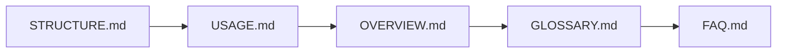

# STRUCTURE.md — Ontological Hierarchy & Boundary Semantics

## 🗂️ Filesystem Topography


### Domain-Specific Directories
| Directory | Type | Mutable? | Script Dependency |
|-----------|------|----------|--------------------|
| `literary_ideas/` | Ephemeral Input | Yes | `scan_unencoded_artifacts.sh` |
| `holding_patterns/` | Quarantine Buffer | Yes | `encode_artifact.sh` |
| `artifact/gen1_*/` | Immutable Trace | ❌ No | `mutate_artifact.sh` (future gens) |
| `system/genX_*/` | Versioned Trace | Yes (via new gens) | `generate_entropy_trace.sh --compare` |

---

## 🔒 Immutability Rules


### Artifact Traces (`entropy_index/artifact/`)
- **Immutable After Creation**:  
  ```bash
  # encode_artifact.sh line 21-24
  if [[ -d "$OUTPUT_DIR" ]]; then
    echo "❌ ERROR: $OUTPUT_DIR exists. Gen1 is immutable." >&2
    exit 1
  fi
  ```
- **Allowed Operations**:  
  - Read (`interpretation.md`)  
  - Compare (via external tools)  
  - Mutate **only** through new generations  

### System Traces (`entropy_index/system/`)
- **Generational Evolution**:  
  ```python
  # generate_entropy_trace.sh comparison logic
  def hamming_distance(current, previous):
      return bin(current ^ previous).count('1')
  ```
- **Allowed Operations**:  
  - Overwrite prior gens (except those referenced by `--compare`)  
  - Delete unused gens  

---

## 🧩 Cross-Domain Interactions


### Ontological Boundaries
| Aspect | Artifact Domain | System Domain |
|--------|-----------------|---------------|
| **Data Source** | User-authored `.md` files | FSM `.py` code |
| **Entropy Driver** | Interpretive contradictions | Code/log changes |
| **Mutation Tool** | `mutate_artifact.sh` (future) | `--compare` flag |
| **Output Example** | `gen1_tau_falsify/` | `gen5_ideational/` |

---
## New Entropy Index Artifacts

```bash
entropy_index/system/genX_<role>/
├── out1.txt                # Contradiction injection logs
├── cms_score.txt           # Collapse Metabolism Score
└── weight_validation.md    # FSM_WEIGHT alignment report
```
## 🚧 Common Structural Errors
### Artifact Domain
```text
ERROR: Cannot encode 'ideational' — reserved for system roles
```
**Fix**: Rename artifact to avoid FSM role names (see `semiotic_engine/src/fsm/`)

### System Domain
```text
ERROR: Missing gen3_paradox_log.md in dialectical_cores/
```
**Fix**: Generate collapse logs before tracing via `semiotic_engine/run_paradox_detector.sh`

### Cross-Domain
```text
WARNING: Tension mismatch between artifact (δ3.2) and system (δ4.1)
```
**Resolution**: See `philosophy/guidelines/tension_calibration.md`

---

## ▶️ Navigational Map


**Next**: Consult [FAQ.md](FAQ.md) for methodological justifications of this structure.