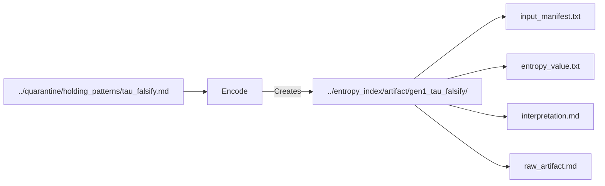
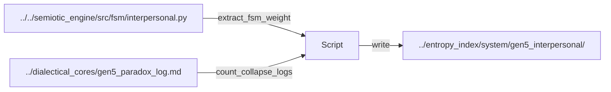
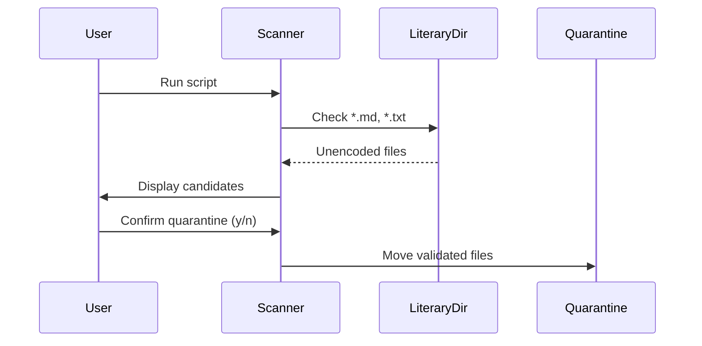
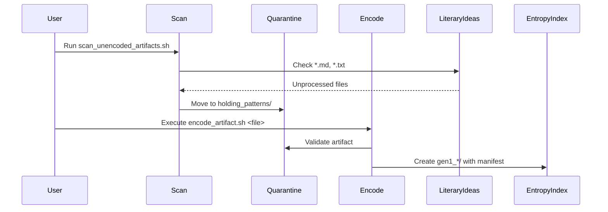
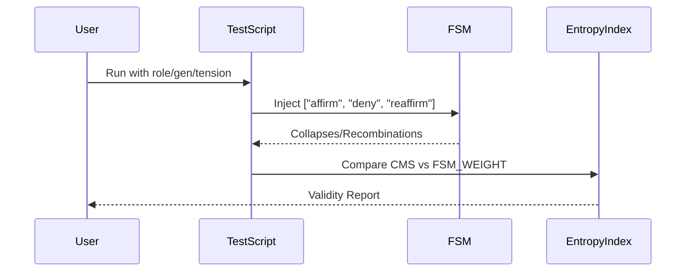
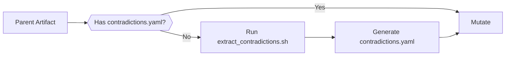

# USAGE.md — Script Workflows & Operational Semantics

## 📜 Artifact Formalization Pipeline
[Full Quickstart Guide](./Epistemic%20Trace%20Details/Epistemic_Trace_Infrastructure_Quick_Start_Guide.md)

### 1. Encode Literary Artifact
**Script**: `encode_artifact.sh`  
**Command**:  
```bash
../../scripts/encode_artifact.sh ../quarantine/holding_patterns/<artifact>.md
```

**Preconditions**:  
- File must first be quarantined via `scan_unencoded_artifacts.sh`  
- Artifact name ≠ reserved FSM roles (`ideational`, `interpersonal`, `textual`)  

**Interactive Prompts**:  
```text
🧬 Encoding rhetorical artifact: tau_falsify.md → ../entropy_index/artifact/gen1_tau_falsify/
FSM_WEIGHT (0.0 = fluid, 1.0 = rigid): 0.75
Tension (δ scalar): 3.2
Collapse_Log (number of contradictions detected): 12
```

**Output Structure**:  


**Critical Constraints**:  
- FSM_WEIGHT ∈ [0.0, 1.0] (validated via regex `^[0-1]\.\d+$`)  
- First-generation traces (`gen1_*`) are immutable (lines 21-24 of script)  

---

## ⚙️ System Role Entropy Tracking

### 2. Generate FSM Trace  
**Script**: `generate_entropy_trace.sh`  
**Command**:  
```bash
# Basic usage
../../scripts/generate_entropy_trace.sh interpersonal gen5 2.8

# Compare generations
../../scripts/generate_entropy_trace.sh operational gen7 4.1 --compare gen6
```

**Data Sources**:  


**Comparison Logic**:  
```python
def compute_hamming_distance(current_hash, previous_hash):
    # Binary XOR of normalized manifest hashes
    return bin(int(current_hash, 16) ^ int(previous_hash, 16)).count('1')
```

**Output Artifacts**:  
- `entropy_diff_manifest.md`: Drift analysis between generations  
- `delta_entropy.txt`: Hamming distance (bits changed)  

---

## 🧼 Epistemic Hygiene Protocol

### 3. Scan & Quarantine New Ideas  
**Process Flow**:  



---
**Encode Artifact Process**
**Script**: `scan_unencoded_artifacts.sh`  




**Script**: `scan_unencoded_artifacts.sh`  
```bash
../../scripts/scan_unencoded_artifacts.sh
```

**Quarantine Rules**:  
| Condition | Action | 
|-----------|--------|
| File exists in `../entropy_index/artifact/` | Skip |
| File already in `holding_patterns/` | Warn |
| Valid new artifact | Move with timestamp |

---
## ⚡ Recursive Collapse Testing (Iteration 3)

### Test FSM Rigidity  
**Script**: `test_fsm_rigidity.sh`  
**Command**:  
```bash
../../scripts/test_fsm_rigidity.sh interpersonal gen5 2.8
```
Process:


Output Metrics:

    Collapse Metabolism Score (CMS): (Recombinations - Collapses) / Total

    Weight Alignment Check: Validates if FSM_WEIGHT matches observed behavior

Interpretation:
CMS Range	FSM_WEIGHT Expectation
> 50	Should have W < 0.6
< 30	Should have W > 0.4
Copy

---

## 🚨 Common Failure Modes

### encode_artifact.sh Errors
```text
❌ ERROR: Reserved FSM role name. Use generate_entropy_trace.sh for system components.
```
**Resolution**: Rename artifact to avoid `ideational|interpersonal|textual`

### generate_entropy_trace.sh Errors
```text
❌ Cannot compare: missing previous generation at gen6_operational
```
**Resolution**: First run base generation without `--compare` flag

### scan_unencoded_artifacts.sh Errors
```text
⚠️ Already in quarantine: paradox_manifesto.md
```
**Resolution**: Either encode or delete from `holding_patterns/`

---
## 🧪 Advanced Epistemic Utilities
### Pre-Mutation
Contradictions go to [quarantine/contradiction_logs](CONTRADICTION_CLASSIFICATION.md#pre-mutation-workflow)


For mutation tracking, contradiction analysis, and entropy visualization, see:  
📂 [`docs/FALSIFICATION.md`](FALSIFICATION.md)

### `mutate_artifact.sh` Requires Contradiction Audit


## ▶️ Next Steps
```bash
# View artifact topography
../../scripts/render_topography.sh --domain artifact

# Compare system role evolution 
../../scripts/render_topography.sh --role interpersonal --gens gen3 gen4 gen5
```

[Technical Deep Dive](./Epistemic%20Trace%20Details/Epistemic_Trace_Infrastructure_Technical_Deep_Dive.md)  
[Ontological Hierarchy](../STRUCTURE.md)


