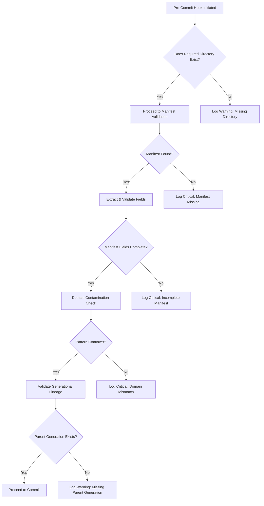

# Comprehensive Trace Validation and Breach Logging System Documentation

*Version: 2.3 • Last Updated: 2025-04-10*

---

## Table of Contents

- [Comprehensive Trace Validation and Breach Logging System Documentation](#comprehensive-trace-validation-and-breach-logging-system-documentation)
  - [Table of Contents](#table-of-contents)
  - [1. Introduction](#1-introduction)
  - [2. System Overview](#2-system-overview)
    - [Architecture](#architecture)
    - [Key Components](#key-components)
  - [3. Validation Protocol Flow](#3-validation-protocol-flow)
    - [Mermaid Flow Diagram](#mermaid-flow-diagram)
  - [4. Structural Integrity Checks](#4-structural-integrity-checks)
    - [Directory Validation](#directory-validation)
    - [Manifest Validation](#manifest-validation)
    - [Domain Contamination and Role Verification](#domain-contamination-and-role-verification)
    - [Generational Lineage](#generational-lineage)
  - [5. Breach Severity Levels and Response Actions](#5-breach-severity-levels-and-response-actions)
  - [6. Pre-Commit Hook Integration](#6-pre-commit-hook-integration)
    - [Hook Configuration and Command-line Options](#hook-configuration-and-command-line-options)
  - [7. Breach Logging System](#7-breach-logging-system)
    - [Log Function Overview](#log-function-overview)
    - [Breach Log Format](#breach-log-format)
    - [Log Organization \& Symbolic Linking](#log-organization--symbolic-linking)
  - [8. Usage Scenarios and Examples](#8-usage-scenarios-and-examples)
    - [Daily Workflow Example](#daily-workflow-example)
    - [Integration in CI/CD Pipeline](#integration-in-cicd-pipeline)
  - [9. Troubleshooting and FAQ](#9-troubleshooting-and-faq)
  - [10. Appendices](#10-appendices)
    - [Related Documents and Standards](#related-documents-and-standards)
    - [Versioning and Update History](#versioning-and-update-history)

---

## 1. Introduction

In modern development workflows, ensuring the structural integrity of artifacts and system traces is critical for maintaining epistemic integrity and operational stability. This documentation describes the Trace Validation and Breach Logging System—a robust protocol that enforces directory and manifest validations, checks domain consistency, and organizes breach logs using a multi-dimensional classification strategy. The system is integrated into your Git workflow via a pre-commit hook to ensure no critical issues escape detection.

---

## 2. System Overview

### Architecture

The system is built around a Bash script deployed as a pre-commit hook. Its core responsibilities include:
- **Validation:** Assessing directories, manifests, and generation relationships.
- **Logging:** Recording any breaches with detailed metadata.
- **Enforcement:** Blocking commits in case of critical failures.

### Key Components

- **Directory and Manifest Validators:** Check if expected directories exist and if manifest files contain required fields.
- **Domain Validator:** Ensures that trace artifacts conform to expected patterns, preventing cross-domain contamination.
- **Log Manager:** A `log_breach()` function that writes log entries to a dynamically structured directory hierarchy while creating symbolic links for multi-dimensional access.
- **Pre-Commit Hook:** Integrates the system into Git, blocking commits on critical errors when running in strict mode.

---

## 3. Validation Protocol Flow

The following flowchart summarizes the step-by-step process used by the system:

### Mermaid Flow Diagram



*Note:* This diagram represents the ideal operation of the protocol and may be extended based on future functional requirements.

---

## 4. Structural Integrity Checks

### Directory Validation

- **Missing Directories:**  
  The system checks if critical directories exist. For example:
  ```bash
  if [[ ! -d "$ARTIFACT_ROOT" ]]; then
      log_breach "WARNING" "Missing artifact directory: $ARTIFACT_ROOT" "N/A" "directory"
  fi
  ```
  - *Behavior:* In normal mode, missing directories trigger a warning; strict mode (`--strict` flag) may force a commit block.

- **Empty Directories:**  
  Directories found empty are logged with an informational severity:
  ```bash
  if [[ -z "$(ls -A "$dir")" ]]; then
      log_breach "INFO" "Empty $domain directory: $dir" "N/A" "directory"
  fi
  ```

### Manifest Validation

Manifest files (typically named `input_manifest.txt`) must include key entries:
- **FSM_WEIGHT:** A weighted float value (0.0 to 1.0).
- **Tension:** A numeric value (usually following a designated symbol, e.g., δ).
- **Collapse_Log:** An integer value (≥ 0).

Example snippet:
```yaml
FSM_WEIGHT: 0.75
Tension: δ3.2
Collapse_Log: 12
```
- **Validation:**  
  Missing or incomplete fields are recorded as a *critical* breach and the commit is blocked.

### Domain Contamination and Role Verification

- **For Artifact Domain:**  
  Names (like `ideational`, `interpersonal`, or `textual`) in artifact traces are prohibited.
  ```bash
  if [[ "$id" =~ ^(ideational|interpersonal|textual)$ ]]; then
      log_breach "CRITICAL" "FSM role detected in artifact domain: $id" "$hash" "domain"
      BLOCK_COMMIT=true
  fi
  ```

- **For System Domain:**  
  Patterns like `tau_*` are disallowed.
  ```bash
  if [[ "$id" =~ ^tau_.* ]]; then
      log_breach "CRITICAL" "Artifact detected in system domain: $id" "$hash" "domain"
      BLOCK_COMMIT=true
  fi
  ```

### Generational Lineage

- **Parent Existence:**  
  For traces with generation numbers (gen2+), a corresponding parent directory must exist.
  ```bash
  if [[ "$gen" =~ gen([2-9][0-9]*) ]]; then
      local prev=$(( ${BASH_REMATCH[1]} - 1 ))
      local prev_dir="$(dirname "$path")/gen${prev}_${id}"
      if [[ ! -d "$prev_dir" ]]; then
          log_breach "WARNING" "Missing parent generation: $prev_dir" "N/A" "lineage"
      fi
  fi
  ```
  - *Note:* Warnings are issued but do not block commits unless enforced by strict mode.

---

## 5. Breach Severity Levels and Response Actions

| **Severity** | **Criteria**                                      | **Commit Action** | **Log Format Example**                           |
|--------------|---------------------------------------------------|-------------------|--------------------------------------------------|
| **CRITICAL** | Missing manifests, incomplete fields, domain errors | Block Commit      | `Missing manifest: gen3_tau`                     |
| **WARNING**  | Missing directories, parent generation issues   | Allow Commit (warn) | `Missing parent generation: gen2_ideational`     |
| **INFO**     | Empty directories                                 | Allow Commit      | `Empty system directory`                         |

*Action:* The system aggregates critical logs in a summary file for quick post-commit review.

---

## 6. Pre-Commit Hook Integration

The validation script is designed to run as a Git pre-commit hook. This ensures that any trace integrity issues are caught before code is committed to the repository.

### Hook Configuration and Command-line Options

- **Pre-Commit Hook Script:**
  ```bash
  # .git/hooks/pre-commit
  #!/bin/bash
  ./scripts/check_trace_integrity.sh --strict  # Enforces strict mode for directory existence and critical checks
  ```
  
- **Command-Line Options:**
  - **Normal Mode:**  
    ```bash
    ./scripts/check_trace_integrity.sh
    ```
    *Allows warnings for missing directories but logs critical errors.*
  
  - **Strict Mode:**  
    ```bash
    ./scripts/check_trace_integrity.sh --strict
    ```
    *Enforces presence of directories and blocks commits on any missing critical input.*

- **Additional Flags:**
  - **Verbose Mode:**
    ```bash
    VERBOSE=1 ./scripts/check_trace_integrity.sh
    ```
    *Prints detailed logs to stdout for debugging purposes.*
  
  - **Report Generation:**
    ```bash
    ./scripts/check_trace_integrity.sh --report
    ```
    *Generates a comprehensive validation report in addition to logging.*

---

## 7. Breach Logging System

### Log Function Overview

The core of the system is the `log_breach()` function. It captures:
- **Severity and message**
- **Unique hash references** (if applicable)
- **Category classification** (defaulting to "structural," but adjustable to "directory," "manifest," "domain," "lineage," etc.)
- **Git branch and timestamp information**

### Breach Log Format

Each breach entry is logged in a Markdown file with a standardized format:
```markdown
## CRITICAL
- Branch: main
- Category: manifest
- Message: Missing manifest: /path/to/trace
- Hash: `N/A`
- Timestamp: 2025-04-10 18:18:01 UTC
- Action: BLOCKED

## WARNING  
- Branch: main
- Category: directory
- Message: Missing artifact directory: /path/to/artifact
- Hash: `N/A`
- Timestamp: 2025-04-10 18:18:02 UTC
- Action: ALLOWED
```
This consistent format facilitates automated parsing and reporting.

### Log Organization & Symbolic Linking

Logs are written to a primary daily directory:
- **By Date:** `philosophy/breach/breach_logs/YYYY/MM/DD`
- **By Severity:** Subdirectories exist for each severity level.
- **By Branch:** There is a branch-specific directory.
- **By Category:** Categorization allows filtering by domain or issue type.

Symbolic links are used to maintain multiple index paths without data duplication:
```bash
ln -sf "../../../$primary_log" "$severity_dir/${timestamp}_${branch}_${category}.md"
ln -sf "../../../$primary_log" "$branch_dir/${timestamp}_${severity,,}_${category}.md"
```

---

## 8. Usage Scenarios and Examples

### Daily Workflow Example

1. **Normal Validation:**
   ```bash
   ./scripts/check_trace_integrity.sh
   ```
   - This will log warnings for non-critical issues but allow commit if all critical validations pass.

2. **Strict Validation:**
   ```bash
   ./scripts/check_trace_integrity.sh --strict
   ```
   - Any missing directories or incomplete manifests will block the commit.

3. **Manual Report Generation:**
   ```bash
   ./scripts/check_trace_integrity.sh --report
   ```
   - Outputs a full validation report including all breach logs for review.

### Integration in CI/CD Pipeline

- Include the script as a pre-commit hook.
- Use reporting features to integrate with logging dashboards.
- Automate notifications if critical breaches occur.

---

## 9. Troubleshooting and FAQ

| **Error Message**                         | **Potential Cause**                                        | **Solution**                                                 |
|-------------------------------------------|------------------------------------------------------------|--------------------------------------------------------------|
| `Missing manifest: /path/to/trace`        | Manifest file not generated or misplaced                   | Run `encode_artifact.sh` to generate the necessary manifest. |
| `FSM role detected in artifact domain: ...` | Incorrect domain naming or misclassification                | Rename trace directory to conform with domain naming.       |
| `Empty system directory`                  | Trace generation failed or incomplete artifact build       | Run `generate_entropy_trace.sh` to populate trace directory.  |
| `Missing parent generation: ...`          | Parent directory absent in lineage for generation 2+ traces  | Review generational structure and ensure upstream traces exist.|

---

## 10. Appendices

### Related Documents and Standards

- **Structural Guidelines:**  
  Detailed directives on trace artifact structure can be found in [STRUCTURE.md](../STRUCTURE.md#boundary-enforcement).
  
- **Contribution Protocol:**  
  Information on how to contribute to trace updates is documented in [CONTRIBUTING.md](../CONTRIBUTING.md#trace-mutations).
  
- **Bias Detection Mechanisms:**  
  See [bias_firewalls.md](./bias_firewalls.md) for details on automatic bias monitoring in trace validations.

### Versioning and Update History


- **v1.0 (2025-04-10):**  
  *Initial release of comprehensive documentation covering the Trace Validation Protocol, breach logging system, and integration guidelines.*


---

*“Validation is the price of epistemic integrity.”*

