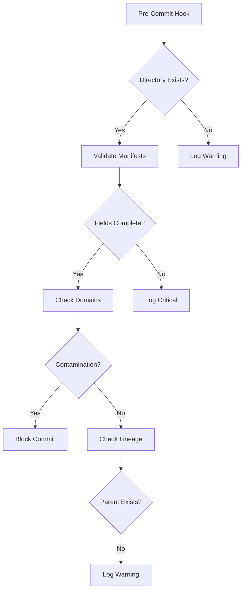

# Trace Validation Protocol



---

## 🔍 Structural Integrity Checks

### 1. Directory Validation
- **Missing Directories**:  
  ```bash
  if [[ ! -d "$ARTIFACT_ROOT" ]]; then
    log_breach "WARNING" "Missing artifact directory"
  fi
  ```
  - Allowed unless `--strict` flag used
- **Empty Directories**:  
  Logged as informational, doesn't block commit

### 2. Manifest Validation
**Required Fields**:
```yaml
FSM_WEIGHT: 0.75  # Must be 0.0-1.0
Tension: δ3.2     # Numeric value after δ
Collapse_Log: 12  # Integer ≥0
```

### 3. Domain Contamination
| Domain | Forbidden Patterns | Example Violation |
|--------|--------------------|-------------------|
| Artifact | `ideational`, `interpersonal`, `textual` | `gen1_ideational/` |
| System | `tau_*` | `gen5_tau_falsify/` |

### 4. Generational Lineage
- Parent generation must exist for gen2+
- Warns but allows commit if missing

---

## 🚨 Breach Severity Levels

| Level | Criteria | Commit Action | Log Example |
|-------|----------|---------------|-------------|
| CRITICAL | Missing manifest, domain contamination | Blocked | `Missing manifest: gen3_tau` |
| WARNING | Missing parent generation | Allowed | `Missing parent: gen2_ideational` |
| INFO | Empty directory | Allowed | `Empty system directory` |

---

## 🔧 Pre-Commit Enforcement

### Hook Configuration
```bash
# .git/hooks/pre-commit
#!/bin/bash
./scripts/check_trace_integrity.sh --strict  # Blocks on critical
```

### Command-Line Options
```bash
# Normal mode (allow missing dirs)
./check_trace_integrity.sh

# Strict mode (require dirs)
./check_trace_integrity.sh --strict

# Output formats
VERBOSE=1 ./check_trace_integrity.sh  # Detailed stdout
```

---

## 📜 Breach Log Format

```markdown
## CRITICAL
- Message: FSM role in artifact domain: ideational
- Hash: `a1b2...`
- Timestamp: 2025-04-10 18:18:01 UTC
- Action: BLOCKED

## WARNING  
- Message: Missing parent generation: gen2_ideational
- Hash: N/A
- Timestamp: 2025-04-10 18:18:02 UTC
- Action: ALLOWED
```

---

## 🧩 Integration Guide

### 1. First-Time Setup
```bash
chmod +x scripts/check_trace_integrity.sh
ln -s ../../scripts/check_trace_integrity.sh .git/hooks/pre-commit
```

### 2. Daily Workflow
```bash
# Manual validation
./scripts/check_trace_integrity.sh --strict

# View last breach
tail -n 15 philosophy/breach/breach_logs/*.md
```

### 3. Troubleshooting
| Error | Solution |
|-------|----------|
| `Commit blocked: Missing manifest` | Run `encode_artifact.sh` to regenerate |
| `FSM role in artifact domain` | Rename trace directory |
| `Empty system directory` | Run `generate_entropy_trace.sh` |

---

## 📚 Related Documents
- [Structural Guidelines](../STRUCTURE.md#boundary-enforcement)  
- [Contribution Protocol](../CONTRIBUTING.md#trace-mutations)  
- [Bias Detection](./bias_firewalls.md)  

---

```bash
# Generate validation report
./scripts/check_trace_integrity.sh --report
```

*"Validation is the price of epistemic integrity."*  
