# YAML Generation: Contradiction Log Lifecycle


---

## 🧠 Purpose

This document defines the **YAML-first workflow** for contradiction-driven mutation, ensuring:

1. All mutations originate from machine-readable contradiction logs  
2. No manual YAML creation - only transformation/validation  
3. Permanent archival of justification proofs  
4. Structural separation between provisional and canonical logs  

---

## 📂 Directory Semantics

| Path | Stage | Mutability | Owner |
|------|-------|------------|-------|
| `literary_ideas/` | Raw input | Uncontrolled | User |
| `quarantine/contradiction_logs/` | Pre-justification | Ephemeral | `extract_contradictions.sh` |
| `entropy_index/artifact/.../` | Embedded proof | Immutable | `mutate_artifact.sh` |
| `contradictions/library/` | Canonical record | Versioned | Archival script |

---

## 🔄 Workflow Enforcement

### 1. Extract Phase
```bash
# Auto-generates structured YAML
./scripts/extract_contradictions.sh <raw_artifact.md>

# Output: philosophy/quarantine/contradiction_logs/gen1_<name>.yaml
```

### 2. Mutation Phase  
```bash
# Consumes YAML, outputs trace
./scripts/mutate_artifact.sh <name> gen1 gen2 \
  --pressure philosophy/quarantine/contradiction_logs/gen1_<name>.yaml
```

### 3. Archive Phase  
```bash
# Auto-runs post-mutation
cp quarantine_log.yaml philosophy/contradictions/library/gen2_<name>.yaml
```

---

## 🧩 Embedded vs Archived YAML

| Aspect | Embedded (Trace) | Archived (Library) |
|--------|------------------|--------------------|
| **Format** | Flattened + hash | Raw structured |
| **Purpose** | Mutation proof | Historical reference |
| **Location** | With artifact gen | Global registry |
| **Mutability** | Immutable | Append-only |

---

## 🚨 Failure Modes

### Invalid Workflow

```mermaid
flowchart TD
    A[Manual YAML Edit] --> B[Mutation Attempt]
    B --> C{{Validate Hashes?}}
    C -->|Yes| D[Reject - Hash Mismatch]
    C -->|No| E[❌ Breach Logged]
```


### Recovery Protocol
1. Purge invalid YAML from `quarantine/`  
2. Re-run extraction from original artifact  
3. Audit affected traces via `scripts/validate_hashes.sh`

---

## 🔗 Related Docs

- [Contradiction Typology Rules](CONTRADICTION_CLASSIFICATION.md)  
- [Falsification Workflows](FALSIFICATION.md#mutation-gates)  
- [Ethical Archiving Guidelines](ETHICS.md#contradiction-preservation)  

---

```bash
# Validate YAML workflow integrity
./scripts/audit_yaml_lifecycle.sh --full
```

*"If you're hand-crafting YAML, you're simulating contradictions - not discovering them."*
